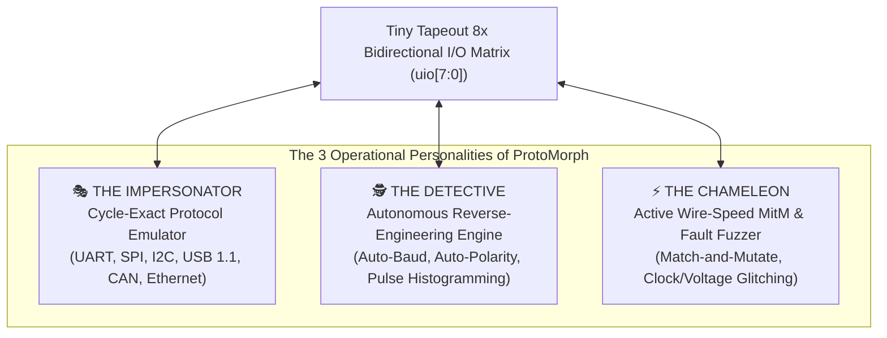
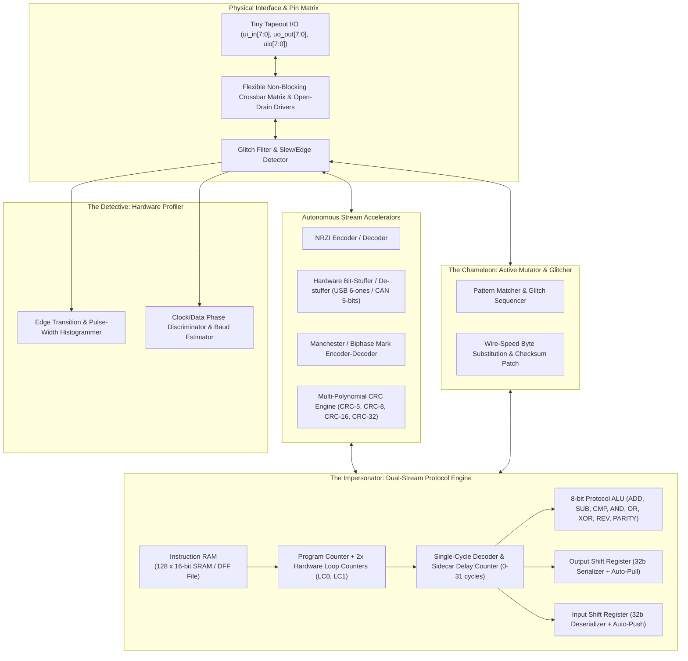
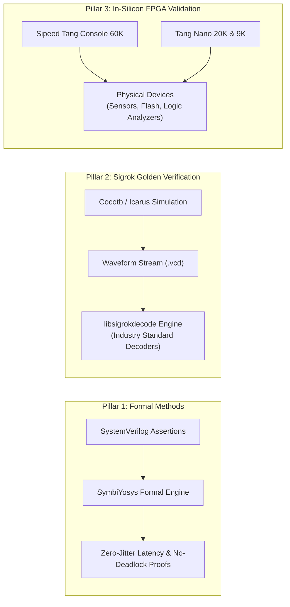

# ProtoMorph: The Adaptive Protocol Chameleon & Security Fuzzing Micro-Engine

> **Jane Street & Tiny Tapeout ASIC Design Challenge Specification**  
> **Target Process**: IHP 130nm CMOS5L (`ttihp-verilog-template`)  
> **Area Budget**: 6×4 Tiles (~0.72 mm², ~20k standard cells)  
> **Submission Deadline**: January 18, 2027 (March 2027 Shuttle)  
> **Repository**: [github.com/fjpolo/ProtocolEmulatorr](https://github.com/fjpolo/ProtocolEmulatorr)

---

## 1. Vision & Creative Philosophy: Thinking Outside the Box

Most protocol solutions fall into one of two boring extremes:
1. **Fixed Hard IP blocks**: A fixed UART, SPI, and I2C block baked into silicon. Zero adaptability to new protocols, impossible to use for reverse engineering or corner-case testing.
2. **Generic Microcontrollers (Cortex-M0 / RISC-V)**: Great for C code, terrible for sub-cycle deterministic bit-banging due to multi-cycle instruction pipelines, cache misses, branch penalties, and interrupt jitter.
3. **RP2040 PIO Clones**: Helpful for simple shift registers, but paralyzed when dealing with packet-level logic, dynamic CRCs, bi-directional token arbitration, or wire-speed packet modification.

### Enter ProtoMorph
**ProtoMorph** is designed from the ground up not merely as a passive transceiver, but as an **Active Hardware Hacker's Swiss-Army Knife**: an autonomous protocol detective, a wire-speed Man-in-the-Middle (MitM) packet mutator, a cycle-accurate glitch/fault fuzzer, and a chameleon emulator capable of shapeshifting into virtually any digital communication standard—from classic industrial buses to retro console gamepads, automotive CAN, and chiptune sound synthesizers.



---

## 2. Five Killer Features You Won't Find in Any Ordinary Protocol Chip

### 🌟 Feature 1: Autonomous Protocol Detective (Zero-Knowledge Reverse Engineering)
When a hardware engineer or security researcher discovers mystery test points on a target PCB, they usually spend hours hooking up an oscilloscope or logic analyzer. 

ProtoMorph includes a dedicated **Hardware Waveform Profiler**:
* **Pulse-Width Histogramming & Auto-Baud Detection**: A high-speed transition timer records the minimum stable pulse duration ($t_{\min}$), calculating the exact baud rate (from 300 baud up to 25 Mbaud at 50 MHz) without software polling.
* **Clock-Phase & Idle-State Discriminator**: Automatically detects if a bus is idle-high (UART/I2C/1-Wire) or idle-low, distinguishes clock lines from data lines via transition-density counters, and infers SPI clock polarity (CPOL) and phase (CPHA).
* **Fingerprint Matching Engine**: Hardware state machines detect framing signatures (e.g., I2C START/STOP conditions, 1-Wire presence pulses, CAN dominant/recessive bit stuffing, USB J/K differential chirp) and automatically report:
  ```
  [AUTODETECT] Pin 0 = I2C SDA, Pin 1 = I2C SCL | 398.2 kHz | Master Active
  ```

### 🌟 Feature 2: Active Wire-Speed Man-in-the-Middle (MitM) & "Match-and-Mutate"
ProtoMorph can sit physically **in-line between two communicating chips** (e.g., between an MCU host and an SPI flash, or between an automotive ECU and a CAN transceiver):
* **Zero-Latency Pass-Through**: Pins `uio[0:3]` bridge directly to `uio[4:7]` with sub-nanosecond propagation delay.
* **On-the-Fly Packet Mutation**: The micro-engine inspects incoming bitstreams in real time. Upon matching a user-defined pattern (e.g., a specific flash read command, a cryptographic challenge, or a CAN frame ID), ProtoMorph can:
  * Invert or substitute payload bytes on-the-fly.
  * Dynamically recalculate and rewrite the CRC checksum before the packet finishes transmitting!
  * Inject deliberate bit-stuffing errors or parity flips to test target error recovery.

### 🌟 Feature 3: Cycle-Accurate Glitch & Fault Injection Engine
Hardware security testing requires precise timing down to the individual clock cycle:
* **Clock Stretching Hijack**: Deliberately holds the I2C `SCL` line low for an arbitrary number of cycles to trigger race conditions or buffer overflows in poorly designed slave state machines.
* **Edge-Triggered Glitch Output**: Fires sub-cycle pulses (down to 10 ns) on an auxiliary trigger pin upon detecting a specific sequence of bytes—enabling perfectly synchronized external voltage/EMFI glitching tools (ChipWhisperer-style).

### 🌟 Feature 4: "Fun & Retro" Swiss-Army Protocols
Who says ASIC design can't be fun? Because ProtoMorph provides cycle-exact timing and flexible I/O serialization, it natively emulates:
* **Retro Gaming Controllers**:
  - **Nintendo 64 / GameCube Joybus**: Bidirectional single-wire open-collector protocol at 250 kbps with strict $1\,\mu\text{s} / 3\,\mu\text{s}$ pulse-width encoding.
  - **NES / SNES Gamepads**: Synchronous 4021-style parallel latch and clocking.
  - **PlayStation 1/2 DualShock Bus**: SPI-like open-drain serial interface with ACK pulses.
* **Digital Audio & Stage Lighting**:
  - **1-bit Delta-Sigma Audio DAC & Chiptune Synthesizer**: Direct audio output via PDM on any GPIO pin.
  - **WS2812B / SK6812 NeoPixel Driver**: Strict $800\,\text{kHz}$ asymmetric NRZ timing ($T_{0H}=350\,\text{ns}, T_{1H}=700\,\text{ns}$).
  - **MIDI Interface (31.25 kbaud)** & **DMX512 Stage Lighting (250 kbaud)**.

### 🌟 Feature 5: On-Chip Self-Play & Built-In Self-Test (BIST)
How do you verify the chip on real silicon after it arrives from the foundry?
ProtoMorph features an **Internal Virtual Crossbar**:
* Channel A (Master) communicates directly with Channel B (Slave) inside the silicon.
* ProtoMorph can run autonomous regression suites on itself: Channel A transmits corner-case packets (with jitter, noise, and corrupted parity) while Channel B attempts recovery, outputting real-time verification scores on the 4 onboard status LEDs!

---

## 3. System Micro-Architecture



---

## 4. Instruction Set Architecture: The "Proto-Byte" 16-bit ISA

Every instruction word is 16 bits wide and executes in a single cycle plus an optional hardware delay counter.

```
+---------------+---------------+-----------------------------------+
| [15:12] (4b)  | [11:7] (5b)   | [6:0] (7b)                        |
| Opcode        | Sidecar Delay | Operand / Sub-operation / Target  |
+---------------+---------------+-----------------------------------+
```

### 4.1. Core Instruction Set

| Opcode | Mnemonic | Syntax | Description |
| :--- | :--- | :--- | :--- |
| `0x0` | **NOP** | `NOP [delay]` | Exact cycle-accurate delay without state modification |
| `0x1` | **OUT** | `OUT pins, count [delay]` | Shifts `count` (1..8) bits from `OSR` to designated pins |
| `0x2` | **IN** | `IN pins, count [delay]` | Samples `count` (1..8) bits from designated pins into `ISR` |
| `0x3` | **SET** | `SET pin, val [delay]` | Sets pin to `0`, `1`, or `Z` (Hi-Z open-drain) |
| `0x4` | **WAIT** | `WAIT pin, level [timeout]` | Blocks until pin hits `level` (with optional cycle timeout) |
| `0x5` | **MOV** | `MOV dst, src [delay]` | Register, ALU, and special function transfer |
| `0x6` | **ALU** | `ADD/SUB/AND/OR/XOR dst, src` | 8-bit arithmetic or bitwise logic |
| `0x7` | **DJNZ** | `DJNZ LCx, target [delay]` | Decrement loop counter; branch if $> 0$ (zero overhead) |
| `0x8` | **JMP** | `JMP [cond], target [delay]` | Conditional jump on Zero, Carry, Pin state, or FIFO status |
| `0x9` | **PULL** | `PULL [ifempty]` | Refills `OSR` from TX FIFO (blocks or flags if empty) |
| `0xA` | **PUSH** | `PUSH [iffull]` | Flushes `ISR` to RX FIFO (clears bit counter) |
| `0xB` | **CRC** | `CRC UPDATE/RESET/FIN` | Feeds active accumulator with CRC-5, CRC-8, or CRC-16 |
| `0xC` | **MUT** | `MUT pattern, replace` | Programs wire-speed MitM byte substitution rule |
| `0xD` | **GLT** | `GLT pin, duration` | Arm edge-triggered sub-cycle glitch pulse |
| `0xE` | **PROF** | `PROF READ_BAUD/TYPE` | Reads detected baud rate or inferred protocol ID |
| `0xF` | **SYNC** | `SYNC channel` | Inter-thread or external trigger synchronization |

---

## 5. Protocol Capabilities Matrix

```mermaid
mindmap
  root((ProtoMorph Protocols))
    Standard Baseline
      UART (300 to 25 Mbps, RS232/485)
      SPI (Modes 0, 1, 2, 3 up to 25 MHz)
      I2C (Standard, Fast, Fast-Mode+, SMBus)
    Debugging & Test
      JTAG TAP Controller (State Sequencer)
      ARM SWD (Single-Wire Debug)
      1-Wire (Dallas DS18B20, iButton)
    High-Speed & Industrial
      USB 1.1 Low-Speed (1.5 Mbps) & Full-Speed (12 Mbps)
      CAN Bus 2.0A/B (125k, 250k, 500k, 1 Mbps)
      10BASE-T Ethernet (Manchester 10 Mbps)
    Retro & Creative Hacks
      Nintendo 64 / GameCube Joybus
      NES / SNES Controller Bus
      WS2812B NeoPixel & APA102 LED Strips
      MIDI & DMX512 Lighting
      Delta-Sigma 1-bit Chiptune Audio DAC
```

---

## 6. Silicon Area Feasibility on IHP 130nm CMOS5L (6×4 Tiles)

The IHP 130nm CMOS5L process through Tiny Tapeout allocates 24 tiles (6×4). At approximately $200\,\mu\text{m} \times 150\,\mu\text{m}$ per tile, the total nominal area is **$0.72\,\text{mm}^2$**, providing an estimated **19,000 to 26,000 standard cells**.

```
+-------------------------------------------------------------------+
| Subsystem Module                           | Estimated Gate Count |
+-------------------------------------------------------------------+
| Proto-Core Datapath, Decoder, ALU          |  3,200 cells         |
| Program Counter, Stack, & Loop Counters    |    850 cells         |
| Register File (R0-R7, Status, Masks)       |  1,200 cells         |
| Dual SERDES Engine (OSR, ISR + Auto-Flow)  |  2,100 cells         |
| Hardware Protocol Assists:                 |                      |
|   - NRZI Encoder/Decoder                   |    450 cells         |
|   - Bit-Stuffer / De-stuffer (USB & CAN)   |    650 cells         |
|   - Multi-Polynomial CRC-5/8/16 Unit       |  1,200 cells         |
|   - Manchester Encoder/Decoder             |    400 cells         |
| Hardware Profiler & Auto-Baud Histogrammer |  1,900 cells         |
| MitM Pattern Matcher & Mutator             |  1,400 cells         |
| Dual Ping-Pong FIFOs (64 bytes each)       |  4,600 cells         |
| Configurable Pin Crossbar & Glitch Filter  |  1,600 cells         |
| Instruction Memory (128 words x 16-bit DFF)|  3,200 cells         |
+-------------------------------------------------------------------+
| TOTAL ESTIMATED STANDARD CELL COUNT        | 21,750 cells         |
| Total Tile Capacity Budget (~25,000 max)   | ~87% utilization     |
+-------------------------------------------------------------------+
```
*Note: If an OpenRAM macro is enabled for CMOS5L on this shuttle, instruction memory can be transitioned to SRAM, shrinking DFF usage by ~3,000 cells and allowing expanded FIFO buffers.*

---

## 7. Novel Verification Methodology: Appealing to Jane Street's Core Values

Jane Street is renowned for its rigor, functional programming passion (OCaml / Hardcaml), and formal methods. We integrate three novel verification pillars into this project:



### 1. Formal Proof of Zero-Jitter Execution & Protocol Properties (SymbiYosys)
* **Deterministic Timing Invariant**: We formally prove that every branch, jump, and sidecar delay resolves in strictly predictable cycles:
  $$\forall \text{ state } s, \quad \text{Latency}(s, \text{instruction}) = 1 + \text{Delay}$$
* **No Contention / Bus-Safety Invariant**: Formal proof that the open-drain controller never drives active-high during an external pull-down state (guaranteeing silicon safety during I2C/1-Wire arbitration).

### 2. "Sigrok-in-the-Loop" Automated Protocol Validation
Rather than relying on ad-hoc testbenches, our simulation framework pipes generated VCD waveforms directly into **libsigrokdecode** (the official protocol decoding library used by PulseView). If our generated USB or CAN packet cannot be decoded cleanly by Sigrok, the testbench fails automatically!

### 3. FPGA-in-the-Loop Physical Testing
Using the newly added project infrastructure in this repository, the complete design will be tested in real silicon against physical chips:
* **Tang Console 60K** (`GW5AT-60B`): Used for high-speed USB 1.1 and Ethernet loopback testing.
* **Tang Nano 20K** (`GW2AR-18C`): Connected to real physical SPI Flash, I2C temperature sensors, and retro controllers.

---

## 8. Summary: Why This Submission Stands Out

| What Others Will Build | What ProtoMorph Delivers |
| :--- | :--- |
| Simple RP2040 PIO clone with 9 instructions | **16-bit domain-specific ISA with sidecar delays & hardware assists** |
| Emulation only (dumb transmitter) | **Tri-mode: Impersonator (Emulator), Detective (Auto-discovery), and Chameleon (MitM Fuzzer)** |
| Manual baud rate configuration in software | **Hardware pulse-width histogramming & auto-baud inference** |
| Standard UART/SPI/I2C only | **UART/SPI/I2C + USB 1.1, CAN, Ethernet, Retro Gamepads, NeoPixels, and Chiptune Audio** |
| Basic ad-hoc Verilog testbenches | **Formal proofs (SymbiYosys), Sigrok decoder integration, and multi-FPGA physical validation** |
