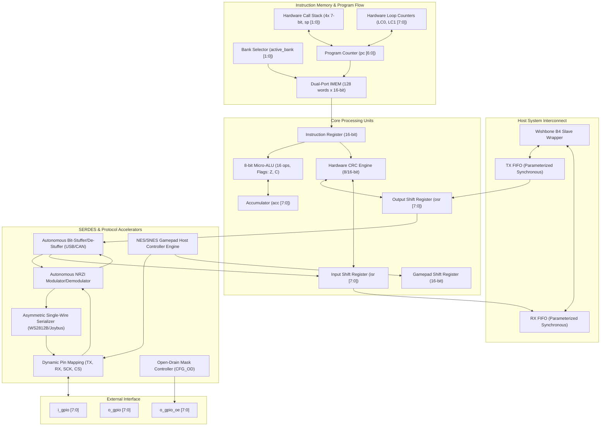

# OmniBus ProtocolEmulator ASIC Datasheet
**High-Performance Autonomous Multi-Protocol Emulation Core**  
**Document Revision**: 1.0 (Architecture Release — Tasks 01 through 18)  
**Target ASIC / FPGA**: Jane Street Silicon / Gowin GW5AST-LV138FPG676A / Generic ASIC Standard Cell  

---

## 1. Device Overview & Key Features

The **OmniBus ProtocolEmulator** is a deterministic, microcode-programmable physical-layer communications processor designed to replace dedicated fixed-function protocol controllers (UART, SPI, I2C, 1-Wire, USB 1.1, CAN 2.0, WS2812B, NES/SNES Gamepad) with a unified, high-speed ASIC architecture.

```
                           +---------------------------------------+
                           |       OmniBus ProtocolEmulator        |
                           |                                       |
    [Host System] <======> | [Wishbone B4 Slave]   [128-word IMEM] | <======> [Physical Pins]
    (Wishbone / FIFO)      | [Synchronous Dual FIFO]  (4 Banks)    |          (8-bit Unified GPIO)
                           | [Micro-ALU]         [SERDES Engine]   |          - Push-Pull / OD
                           | [CRC Accelerator]   [Pulse Engine]    |          - Dynamic PINMAP
                           | [Stream Stuffer]    [NRZI Modulator]  |
                           +---------------------------------------+
```

### Key Architectural Specifications
- **Deterministic Zero-Jitter Execution Engine**: Microcode instructions execute in single clock cycles with precision cycle-accurate sidecar delays (up to 5,110 cycles per bit or runtime dynamic baud divisor).
- **128-Word Instruction Memory (IMEM)**: Dual-port, runtime-reconfigurable memory divided into 4 selectable 32-word banks (`BANK 0` through `BANK 3`) with in-band or Wishbone programming.
- **8-Bit Unified Bidirectional GPIO Bus**: Any protocol role (`TX`, `RX`, `SCK`, `CS`) dynamically mappable to any GPIO pin (`PINMAP`) with per-pin open-drain control (`CFG_OD`).
- **Single-Cycle 8-Bit Micro-ALU**: 16 arithmetic, logical, and bitwise operations (`ADD`, `ADC`, `SUB`, `SBB`, `AND`, `OR`, `XOR`, `NOT`, `NEG`, `SHL`, `SHR`, `ROL`, `ROR`, `SWAP`, `MOV`, `CLR`) with hardware `Zero` and `Carry` flags.
- **Hardware Subroutine Stack**: 4-deep call stack (`CALL`, `RET`) with 2-bit saturating pointer for modular protocol routines.
- **Zero-Overhead Loop Counters**: Dual independent 8-bit counters (`LC0`, `LC1`) with decrement-and-jump-if-not-zero (`DJNZ`) and register exchange instructions.
- **Hardware Multi-Polynomial CRC Generator**: Single-cycle parallel 8-bit XOR tree supporting CRC-8 Dallas/1-Wire ($x^8 + x^5 + x^4 + 1$), CRC-8 SMBus ($x^8 + x^2 + x^1 + 1$), CRC-16 CCITT ($x^{16} + x^{12} + x^5 + 1$), and CRC-16 Modbus ($x^{16} + x^{15} + x^2 + 1$).
- **Autonomous Stream Accelerators**:
  - **NRZI Modulator/Demodulator**: Hardware toggle-on-zero / hold-on-one encoder and single-cycle combinational edge detector.
  - **Hardware Bit-Stuffer / De-Stuffer**: Autonomous insertion and stripping of complementary bits for **USB 1.1** (stuff on 6 ones) and **CAN 2.0** (stuff on 5 identical bits) with hardware framing error latch (`stuff_error`) and conditional branch (`JMP STUFF_ERR`).
- **Asymmetric Single-Wire & Retro Physical Accelerators**:
  - **Single-Wire Pulse Serializer**: 2-phase asymmetric pulse generator with configurable active/rest periods for **WS2812B NeoPixel** (800 kHz NRZ) and **Nintendo N64 / GameCube Joybus** (250 kHz open-drain).
  - **Retro Gamepad Host Engine**: Autonomous 4-phase sequence generating latch pulses, clock bursts, and synchronous sampling for **NES (8-bit)** and **SNES (16-bit)** controllers.
- **Host System Interconnect**: Pipelined **Wishbone B4 Slave Wrapper** with dual parameterized synchronous FIFOs (TX/RX) and hardware status flags.

---

## 2. ASIC Pinout & Terminal Descriptions

| Pin Name | Direction | Type | Reset State | Description |
| :--- | :--- | :--- | :--- | :--- |
| **`i_clk`** | Input | Digital Clock | — | Master system clock (Nominal 50 MHz, max 100+ MHz standard-cell). |
| **`i_reset_n`** | Input | Active-Low Asynch/Synch | — | Active-low system reset. Initializes all registers and halts core. |
| **`i_prog_en`** | Input | Digital Control | Low | IMEM Programming Mode Enable. Freezes core and grants write access to IMEM. |
| **`i_prog_addr[6:0]`** | Input | 7-bit Address | 7'd0 | Direct IMEM write address aperture (0..127 across 4 banks). |
| **`i_prog_data[15:0]`** | Input | 16-bit Data Bus | 16'd0 | 16-bit microcode instruction word to write into IMEM. |
| **`i_baud_div[15:0]`** | Input | 16-bit Data Bus | 16'd0 | External runtime baud rate divisor (16-bit clock prescaler). |
| **`i_gpio[7:0]`** | Input | 8-bit Bidirectional Bus | — | Physical input pins from exterior pad ring. |
| **`o_gpio[7:0]`** | Output | 8-bit Bidirectional Bus | 8'b1111_1101 | Physical output drivers to pad ring (Pin 0 high, Pin 1 low, Pin 2 high). |
| **`o_gpio_oe[7:0]`** | Output | 8-bit Output Enable | 8'b0000_0111 | Tri-state output enable mask (1 = Drive, 0 = Hi-Z input). |
| **`o_tx`** | Output | Push-Pull | 1'b1 | Dedicated legacy UART TX port (mirrors `gpio_out_reg[tx_pin]`). |
| **`i_tx_valid`** | Input | Handshake | Low | TX FIFO write strobe / data valid flag from host. |
| **`o_tx_ready`** | Output | Handshake | High | TX FIFO ready to accept next byte from host. |
| **`o_rx_valid`** | Output | Handshake | Low | RX FIFO contains valid received data for host. |
| **`i_rx_ready`** | Input | Handshake | Low | Host acknowledge / pop strobe to read next byte from RX FIFO. |
| **`o_tx_empty`** | Output | Status Flag | High | Asserted when TX FIFO contains 0 bytes. |
| **`o_tx_full`** | Output | Status Flag | Low | Asserted when TX FIFO is completely full. |
| **`o_rx_empty`** | Output | Status Flag | High | Asserted when RX FIFO contains 0 bytes. |
| **`o_rx_full`** | Output | Status Flag | Low | Asserted when RX FIFO is completely full. |

---

## 3. Internal Block Diagram



---

## 4. Register Organization & Memory Architecture

### A. Architectural Registers

| Register | Width | Reset Value | Functional Description |
| :--- | :--- | :--- | :--- |
| `pc` | 7 bits | `7'd0` | Current microcode execution pointer (0..127 across 4 banks). |
| `delay_cnt` | 16 bits | `16'd0` | Zero-jitter timing countdown timer. Freezes execution while non-zero. |
| `active_bank` | 2 bits | `2'b00` | Currently selected 32-word IMEM bank (0, 1, 2, or 3). |
| `acc` | 8 bits | `8'h00` | Micro-ALU working accumulator. |
| `zero_flag` | 1 bit | `1'b0` | ALU Zero flag. Set if last ALU result was 0x00. |
| `carry_flag` | 1 bit | `1'b0` | ALU Carry/Borrow flag. |
| `osr` | 8 bits | `8'h00` | Output Shift Register for multi-cycle serial transmission. |
| `isr` | 8 bits | `8'h00` | Input Shift Register for multi-cycle serial reception. |
| `sp` | 2 bits | `2'b00` | Subroutine call stack pointer (supports nesting depth 0..3). |
| `call_stack[0..3]` | 7 bits each | `7'd0` | LIFO storage for return program counter addresses. |
| `lc0` | 8 bits | `8'h00` | Primary hardware loop counter for `DJNZ LC0`. |
| `lc1` | 8 bits | `8'h00` | Secondary hardware loop counter for `DJNZ LC1`. |
| `crc_reg` | 16 bits | `16'h0000` | Running CRC accumulator register. |
| `crc_seed` | 16 bits | `16'h0000` | Initial polynomial seed register. |
| `crc_poly` | 2 bits | `2'b00` | Polynomial selector: `00`=CRC8-Dallas, `01`=CRC8-SMBus, `10`=CRC16-CCITT, `11`=CRC16-Modbus. |
| `tx_pin` | 3 bits | `3'd0` | GPIO index assigned to Protocol TX / MOSI / SDA output. |
| `rx_pin` | 3 bits | `3'd0` | GPIO index assigned to Protocol RX / MISO / SDA input. |
| `sck_pin` | 3 bits | `3'd1` | GPIO index assigned to Protocol SCK / SCL clock output. |
| `cs_pin` | 3 bits | `3'd2` | GPIO index assigned to Protocol CS_n / LATCH output. |
| `gpio_od` | 8 bits | `8'h00` | Open-drain mask: `1` = Pin operates in open-drain, `0` = Push-pull. |
| `assist_nrzi_en` | 1 bit | `1'b0` | Hardware NRZI modulator/demodulator enable. |
| `assist_stuff_mode`| 2 bits | `2'b00` | Bit-stuffing mode: `00`=Off, `01`=USB 1.1 (6 ones), `10`=CAN 2.0 (5 identical). |
| `stuff_error` | 1 bit | `1'b0` | Framing violation error flag asserted on illegal bit-stuffing runs. |
| `pulse_mode` | 2 bits | `2'b00` | `00`=Off, `01`=Pulse Serializer (WS2812B/Joybus), `10`=Gamepad Host (NES/SNES). |
| `pulse_polarity` | 1 bit | `1'b0` | `0`=Active High (NeoPixel), `1`=Active Low Open-Drain (Joybus). |
| `pulse_msb_first` | 1 bit | `1'b0` | `1`=MSB-first (NeoPixel), `0`=LSB-first (Joybus). |
| `t_act_0` | 8 bits | `8'd19` | Bit '0' active duration (cycles). Default 20 cycles @ 50 MHz (400 ns). |
| `t_rest_0` | 8 bits | `8'd41` | Bit '0' rest duration (cycles). Default 42 cycles @ 50 MHz (840 ns). |
| `t_act_1` | 8 bits | `8'd39` | Bit '1' active duration (cycles). Default 40 cycles @ 50 MHz (800 ns). |
| `t_rest_1` | 8 bits | `8'd21` | Bit '1' rest duration (cycles). Default 22 cycles @ 50 MHz (440 ns). |
| `t_latch` | 8 bits | `8'd60` | Gamepad LATCH pulse duration (cycles). |
| `pad_snes_16b` | 1 bit | `1'b0` | Gamepad format: `0`=8-bit NES mode, `1`=16-bit SNES mode. |
| `pad_shift_reg` | 16 bits | `16'h0000` | Hardware 16-bit storage register for SNES controller button states. |

### B. Wishbone B4 Slave Memory Map

The ProtocolEmulator provides a standard 32-bit pipelined Wishbone B4 slave interface for host microprocessors (RISC-V, ARM, host PC):

| Offset Address | Register Name | Access | Width | Description |
| :--- | :--- | :--- | :--- | :--- |
| **`0x00`** | `WB_REG_TX_DATA` | W | 8 bits | Push byte into hardware TX FIFO. |
| **`0x04`** | `WB_REG_RX_DATA` | R | 8 bits | Pop byte from hardware RX FIFO. |
| **`0x08`** | `WB_REG_FIFO_STATUS`| R | 8 bits | FIFO status: `[0]`=TX Empty, `[1]`=TX Full, `[2]`=RX Empty, `[3]`=RX Full. |
| **`0x0C`** | `WB_REG_BAUD_DIV` | R/W | 16 bits | Runtime baud divisor prescaler register. |
| **`0x10`** | `WB_REG_CORE_CTRL` | R/W | 8 bits | Core control: `[0]`=Core Enable, `[1]`=IMEM Programming Mode. |
| **`0x80 – 0xFF`**| `WB_IMEM_APERTURE` | R/W | 16 bits | Direct access to 128 microcode memory words (Words 0..127). |

---

## 5. Complete Instruction Set Architecture (ISA)

The OmniBus instruction set consists of 16-bit words. Execution is strictly deterministic: instructions execute in 1 clock cycle unless an active multi-cycle serializer or sidecar delay countdown is pending.

```
+---------------+---------------+---------------+---------------+
| 15 14 13 12   | 11 10 9 8     | 7 6 5 4       | 3 2 1 0       |
+---------------+---------------+---------------+---------------+
| Opcode (4b)   | Sub-Op / Pin  | Data / Delay Field            |
+---------------+---------------+---------------+---------------+
```

### ISA Summary Reference Table

| Opcode | Mnemonic | Syntax | Description |
| :---: | :--- | :--- | :--- |
| **`0x0`** | `NOP` | `NOP [delay]` | No operation. Pauses core for `[delay]` clock cycles. |
| **`0x1`** | `OUT` | `OUT [tx], <count> [, delay]` | Serialize `<count>` bits from OSR to `tx_pin`. (Auto-SCK / 1W / Pulse). |
| **`0x2`** | `IN` | `IN [rx], <count> [, delay]` | Deserialize `<count>` bits from `rx_pin` into ISR. (Auto-SCK / 1W / Gamepad). |
| **`0x3`** | `SET` | `SET <pin>, <val> [, delay]` | Set selected GPIO pin output level to `<val>` (`0` or `1`). |
| **`0x4`** | `WAIT` | `WAIT <pin>, <val> [, delay]`| Block core execution until GPIO pin matches `<val>`, then delay. |
| **`0x5`** | `PINMAP` | `PINMAP TX, RX, SCK, CS` | Dynamically assign pin indices (0..7) to protocol roles. |
| **`0x6`** | `CFG_OD` | `CFG_OD <mask>` | Configure 8-bit open-drain output enable mask. |
| **`0x7`** | `LOOP` | `DJNZ <lc>, <target>` | Decrement loop counter and branch to `<target>` if not zero. |
| | | `SET_LC <lc>, <imm8>` | Load 8-bit immediate value into loop counter `LC0` or `LC1`. |
| | | `PULL_LC <lc>` | Latch host input data `i_data` into loop counter. |
| | | `PUSH_LC <lc>` | Copy loop counter value to output register `o_data`. |
| | | `MOV_LC <dst>, <src>` | Transfer count value between `LC0` and `LC1`. |
| **`0x8`** | `JMP` | `JMP [cond,] <target>` | Jump to `<target>` (Always, Z, NZ, C, NC, FIFO flags, STUFF_ERR). |
| **`0x9`** | `PULL` | `PULL [BLOCK]` | Transfer byte from TX FIFO (`i_data`) into OSR. |
| **`0xA`** | `PUSH` | `PUSH [BLOCK]` | Transfer byte from ISR into RX FIFO (`o_data`). |
| **`0xB`** | `ALU` | `ALU <op> [, <operand>]` | Execute single-cycle arithmetic/logical operation on Accumulator. |
| **`0xC`** | `CALL` | `CALL <target>` | Push return address to hardware stack and branch to `<target>`. |
| | `RET` | `RET` | Pop return address from hardware stack and resume execution. |
| **`0xD`** | `BANK` | `BANK <0..3>` | Switch active 32-word IMEM execution bank (Banks 0..3). |
| **`0xE`** | `CRC` | `CRC <subop> [, <param>]`| Control hardware CRC generator (CFG, FEED, READ_LO, READ_HI). |
| **`0xF`** | `ASSIST`| `ASSIST <subop> [, <cfg>]`| Control stream accelerators (NRZI, Bit-Stuffer, Pulse, Gamepad). |

---

### Detailed Opcode Specifications

#### Opcode `0x1` — `OUT` (Multi-Protocol Serializer)
- **Format**: `16'b0001_MM_S_CCCC_DDDDDDDD`
  - `MM`: Serializer Mode:
    - `00`: Standard Asynchronous Serializer / Pulse Serializer
    - `01`: Synchronous SPI Mode (`OUT SCK`) — auto-toggles `sck_pin`
    - `10`: 1-Wire Mode (`OUT 1W`) — generates 11x bit slots (Write 0 / Write 1)
    - `11`: Synchronous I2C Mode (`OUT SDA`) — auto-toggles `sck_pin` (SCL)
  - `S`: 1-Wire bit slot mode (`0` = 8-bit byte, `1` = 1-bit slot for ROM search)
  - `CCCC`: Bit count (0 = 8 bits, 1..7 = 1..7 bits)
  - `DDDDDDDD`: Sidecar bit duration delay. Special sentinel `9'h1FF` selects `i_baud_div[8:0]`.

#### Opcode `0x2` — `IN` (Multi-Protocol Deserializer)
- **Format**: `16'b0010_MM_S_CCCC_DDDDDDDD`
  - If `pulse_mode == 2'b10`: Autonomous **NES/SNES Gamepad Host Mode**. Emits `t_latch` pulse on `cs_pin`, bursts 8 or 16 clock cycles on `sck_pin`, and shifts buttons into `isr` and `pad_shift_reg`.
  - `MM = 01`: Synchronous SPI Master Read (`IN SCK`).
  - `MM = 10`: 1-Wire Master Read (`IN 1W`).
  - `MM = 11`: Synchronous I2C Master Read (`IN SDA`).

#### Opcode `0x8` — `JMP` (Conditional & Flag Branching)
- **Format**: `16'b1000_CCCC_0_AAAAAAA`
  - `AAAAAAA`: 7-bit branch target address (0..127).
  - `CCCC`: Condition Code:
    - `4'h0`: Unconditional (`JMP <addr>`)
    - `4'h1`: Zero (`JMP Z, <addr>`)
    - `4'h2`: Not Zero (`JMP NZ, <addr>`)
    - `4'h3`: Carry (`JMP C, <addr>`)
    - `4'h4`: Not Carry (`JMP NC, <addr>`)
    - `4'h5`: TX FIFO Not Full (`JMP TX_READY, <addr>`)
    - `4'h6`: RX FIFO Not Empty (`JMP RX_VALID, <addr>`)
    - `4'h7`: TX FIFO Empty (`JMP TX_EMPTY, <addr>`)
    - `4'h8`: RX FIFO Full (`JMP RX_FULL, <addr>`)
    - `4'hF`: Bit-Stuffing Framing Violation (`JMP STUFF_ERR, <addr>`)

#### Opcode `0xB` — `ALU` (8-Bit Arithmetic & Logic Unit)
- **Format**: `16'b1011_CCCC_DDDDDDDD`
  - `CCCC = 0x0`: `ADD acc, imm8`
  - `CCCC = 0x1`: `ADC acc, imm8` (Add with carry)
  - `CCCC = 0x2`: `SUB acc, imm8`
  - `CCCC = 0x3`: `SBB acc, imm8` (Subtract with borrow)
  - `CCCC = 0x4`: `AND acc, imm8`
  - `CCCC = 0x5`: `OR  acc, imm8`
  - `CCCC = 0x6`: `XOR acc, imm8`
  - `CCCC = 0x7`: `NOT acc`
  - `CCCC = 0x8`: `NEG acc` (Two's complement)
  - `CCCC = 0x9`: `SHL acc` (Shift left into carry)
  - `CCCC = 0xA`: `SHR acc` (Shift right into carry)
  - `CCCC = 0xB`: `ROL acc` (Rotate left through carry)
  - `CCCC = 0xC`: `ROR acc` (Rotate right through carry)
  - `CCCC = 0xD`: `SWAP acc` (Exchange upper and lower nibbles)
  - `CCCC = 0xE`: Register Transfer:
    - `instr[7:0] = 0x00`: `MOV acc, osr`
    - `instr[7:0] = 0x01`: `MOV osr, acc`
    - `instr[7:0] = 0x02`: `MOV acc, isr`
    - `instr[7:0] = 0x03`: `MOV isr, acc`
  - `CCCC = 0xF`: `CLR acc` (Clear accumulator and flags)

#### Opcode `0xF` — `ASSIST` (Hardware Physical Stream Accelerators)
- **Format**: `16'b1111_SS_XXXXXXXXXX`
  - `SS = 00`: `ASSIST CFG, NRZI=<0|1>, STUFF=<0|USB|CAN> [, INIT=<0|1>]`
  - `SS = 01`: `ASSIST RESET` (Clears bit-stuff counters and `stuff_error` flag)
  - `SS = 10`: `ASSIST READ [, PAD_HIGH]`
    - `instr[9] = 0`: Read status into `acc`: `{stuff_error, nrzi_en, stuff_mode[1:0], 1'b0, tx_stuff_cnt[2:0]}`
    - `instr[9] = 1`: Read upper byte of 16-bit SNES gamepad (`pad_shift_reg[15:8]`) into `acc`
  - `SS = 11`: Task 18 Pulse & Retro Gamepad Configurations:
    - `instr[9:8] = 00`: `ASSIST PULSE_CFG [, NEOPIXEL | JOYBUS]`
    - `instr[9:8] = 01`: `ASSIST GAMEPAD_CFG, <NES | SNES> [, LATCH=<cycles>]`
    - `instr[9:8] = 10`: `ASSIST PULSE_TIME0, <t_act_0>`
    - `instr[9:8] = 11`: `ASSIST PULSE_TIME1, <t_act_1>`

---

## 6. Physical Protocol Profiles & Timing Characteristics

### 1. WS2812B NeoPixel 800 kHz Profile
- **Clock**: Nominal 50 MHz system clock ($T_{clk} = 20\,\text{ns}$).
- **Logic 0**: 400 ns High (`t_act_0 = 19`, 20 cycles) + 840 ns Low (`t_rest_0 = 41`, 42 cycles). Total: $1.24\,\mu\text{s}$.
- **Logic 1**: 800 ns High (`t_act_1 = 39`, 40 cycles) + 440 ns Low (`t_rest_1 = 21`, 22 cycles). Total: $1.24\,\mu\text{s}$.
- **Reset Latch**: Drive line low for $>50\,\mu\text{s}$ using `SET tx, 0, 2500`.

### 2. Nintendo N64 / GameCube Joybus Profile
- **Bus Type**: Single-wire bi-directional open-drain with $1\,\text{k}\Omega$ pull-up resistor to 3.3V.
- **Clock**: 50 MHz system clock.
- **Logic 0**: 3 µs Low (`t_act_0 = 149`, 150 cycles) + 1 µs Hi-Z (`t_rest_0 = 49`, 50 cycles).
- **Logic 1**: 1 µs Low (`t_act_1 = 49`, 50 cycles) + 3 µs Hi-Z (`t_rest_1 = 149`, 150 cycles).
- **Stop Bit**: 1 µs Low + 2 µs Hi-Z.

### 3. NES / SNES Gamepad Controller Bus
- **Wiring**: 3-wire interface — `cs_pin` (LATCH), `sck_pin` (CLOCK), `rx_pin` (DATA, active-low pull-up).
- **LATCH Pulse**: Autonomous high pulse on `cs_pin` for `t_latch` cycles (default $1.2\,\mu\text{s}$).
- **Clock Burst**: Generates 8 pulses (NES) or 16 pulses (SNES) on `sck_pin` at half baud period.
- **Data Capture**:
  - NES (8 bits): A, B, SELECT, START, UP, DOWN, LEFT, RIGHT $\rightarrow$ latched in `isr`.
  - SNES (16 bits): Lower byte $\rightarrow$ `isr`, Upper byte $\rightarrow$ `pad_shift_reg[15:8]` (read via `ASSIST READ, PAD_HIGH`).

---

## 7. Electrical & Timing Specifications

### Absolute Maximum Ratings
- Core Supply Voltage ($V_{DD}$): $-0.3\,\text{V}$ to $+1.32\,\text{V}$ (ASIC Core) / $+3.6\,\text{V}$ (I/O Ring)
- DC Input Voltage on GPIO: $-0.5\,\text{V}$ to $V_{DDIO} + 0.5\,\text{V}$ (5V tolerant with external current-limiting resistor)
- Maximum Output Current per Pin: $\pm 12\,\text{mA}$

### Recommended Operating Conditions
- System Clock Frequency ($f_{CLK}$): $1\,\text{MHz}$ to $60\,\text{MHz}$ (Nominal $50\,\text{MHz}$ on GW5AST / Jane Street ASIC).
- GPIO Pull-up Resistor for Open-Drain (I2C, 1-Wire, Joybus): $1.0\,\text{k}\Omega$ to $4.7\,\text{k}\Omega$.

---

## 8. Assembly Programming & Toolchain Reference

Programs are compiled using the bundled Python assembler `python/omnibus_asm.py`:
```bash
python python/omnibus_asm.py examples/ws2812_rainbow_demo.asm -o build/ws2812.hex
```

### Complete Example 1: WS2812B 24-Bit RGB NeoPixel Frame Generator
```asm
; ==============================================================================
; OmniBus NeoPixel Driver (24-bit GRB Transmission)
; ==============================================================================
PINMAP tx=0, rx=1, sck=2, cs=3
CFG_OD 0x00                     ; Push-pull on TX pin 0
ASSIST PULSE_CFG, NEOPIXEL      ; 800 kHz active-high pulse mode

; Send Green Byte (0x55)
ALU MOV, acc, 0x55
ALU MOV, osr, acc
OUT tx, 8

; Send Red Byte (0xAA)
ALU MOV, acc, 0xAA
ALU MOV, osr, acc
OUT tx, 8

; Send Blue Byte (0x33)
ALU MOV, acc, 0x33
ALU MOV, osr, acc
OUT tx, 8

; Reset Latch (>50 us low)
SET tx, 0, 2500
NOP
```

### Complete Example 2: SNES 16-Bit Gamepad Controller Reader
```asm
; ==============================================================================
; OmniBus SNES Controller Host Reader
; ==============================================================================
PINMAP tx=0, rx=0, sck=1, cs=2  ; Pin 2 = LATCH, Pin 1 = CLOCK, Pin 0 = DATA
CFG_OD 0x00
ASSIST GAMEPAD_CFG, SNES, LATCH=30

; Trigger autonomous 16-clock gamepad sample sequence
IN rx, 8, 25                    ; Sample 16 bits; lower byte latches in ISR

; Read lower 8 buttons (B, Y, SELECT, START, UP, DOWN, LEFT, RIGHT)
PUSH                            ; Send lower byte to host RX FIFO

; Read upper 8 buttons (A, X, L, R, signature bits)
ASSIST READ, PAD_HIGH           ; acc <= pad_shift_reg[15:8]
ALU MOV, isr, acc
PUSH                            ; Send upper byte to host RX FIFO
NOP
```
