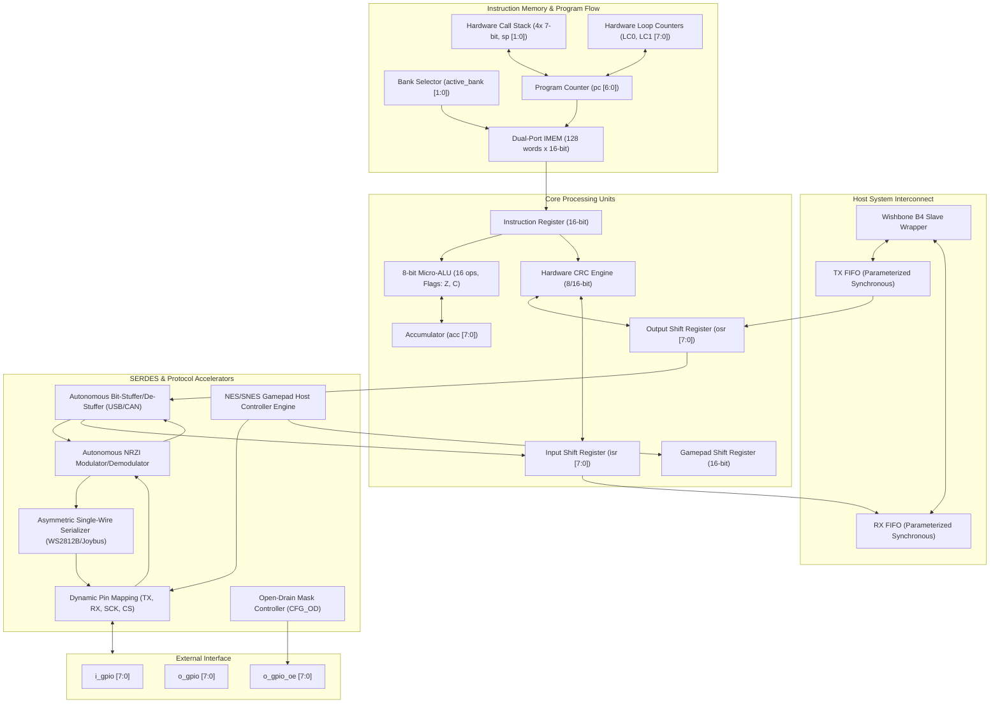

# OmniBus ProtocolEmulator ASIC Datasheet
**High-Performance Autonomous Multi-Protocol Emulation Core**  
**Document Revision**: 1.6 (Architecture Release — Tasks 01 through 24)
**Target ASIC / FPGA**: Jane Street Silicon / Gowin GW5AST-LV138FPG676A / Generic ASIC Standard Cell  

---

## 1. Device Overview & Key Features

The **OmniBus ProtocolEmulator** is a deterministic, microcode-programmable physical-layer communications processor designed to replace dedicated fixed-function protocol controllers (UART, SPI, I2C Master/Slave, SMBus, 1-Wire, USB 1.1, CAN 2.0, WS2812B, NES/SNES Gamepad, 10BASE-T Ethernet, S/PDIF, DALI, 1-Bit Delta-Sigma Audio DAC, IEEE 1149.1 JTAG, ARM Serial Wire Debug SWD) with a unified, high-speed ASIC architecture.

```
                           +---------------------------------------+
                           |       OmniBus ProtocolEmulator        |
                           |                                       |
    [Host System] <======> | [Wishbone B4 Slave]   [128-word IMEM] | <======> [Physical Pins]
    (Wishbone / FIFO)      | [Synchronous Dual FIFO]  (4 Banks)    |          (8-bit Unified GPIO)
                           | [Micro-ALU]         [SERDES Engine]   |          - Push-Pull / OD
                           | [32-bit CRC Engine] [Pulse Engine]    |          - Dynamic PINMAP
                           | [Stream Stuffer]    [NRZI Modulator]  |          - Manchester / BMC
                           | [I2C Slave Engine]  [Clock Stretch]   |          - Open-Drain I2C
                           | [Delta-Sigma DAC]   [4-Voice APU]     |          - PDM / BTL Audio
                           +---------------------------------------+
```

### Key Architectural Specifications
- **Deterministic Zero-Jitter Execution Engine**: Microcode instructions execute in single clock cycles with precision cycle-accurate sidecar delays (up to 5,110 cycles per bit or runtime dynamic baud divisor).
- **1-Bit Delta-Sigma Audio DAC & 4-Voice Chiptune APU Synthesizer**: 50 MHz 1st-order Delta-Sigma ($\Sigma$-$\Delta$) PDM modulator with $OSR = 1250\times$, single-ended and differential BTL outputs on GPIO pins, 4 polyphonic synthesizer voices (Pulse 1, Pulse 2 with 4 duty cycles, 16-step Triangle, 15-bit/7-bit Galois LFSR Noise), saturation-clamped mixer ($V \le 255$), autonomous hardware sound effects (`BEEP`, `BLIP`, `ERROR`, `COIN`, `LASER`, `SIREN`, `NOISE`), and single-cycle PCM streaming (`OUT AUDIO`).
- **Quad-SPI (QSPI), Dual-SPI & Octal-SPI Multi-Lane Flash & PSRAM Hardware Host Controller**:
  - High-throughput multi-lane serial interface supporting Single (1-bit), Dual (2-bit), Quad (4-bit IO0..IO3), and Octal (8-bit across all 8 GPIO pins) modes.
  - **Autonomous Protocol Phase Sequencer**: Hardware automation of Instruction Phase (`QSPI_CMD`), Address Phase (`QSPI_ADDR 24|32` across active lanes), Dummy Clock Phase (`QSPI_DUMMY 0..15` with bus in Hi-Z), and multi-byte stream transfers (`IN QSPI`, `OUT QSPI`) with auto-clock toggling.
  - **Direct Memory Support**: High-speed communication with Winbond (W25Q128 Quad Fast Read `0xEB`), Macronix (MX25), Micron, ISSI, and APMemory (APS6404 QSPI PSRAM).
- **Dedicated Hardware JTAG TAP Controller & ARM SWD Hardware Sequencer (Supporting RISC-V DTM & ARM CoreSight)**:
  - **IEEE 1149.1 16-State JTAG TAP Controller**: Fully autonomous hardware FSM (`jtag_state`) with smart multi-clock TMS stepping (`JTAG_NAV RESET`, `IDLE`, `SHIFT_DR`, `SHIFT_IR`, `EXIT_TO_IDLE`), high-speed 1-to-8 bit Data/Instruction Register shifts with auto-Exit1-DR (`JTAG_SHIFT`), and RISC-V Debug Module (DTM) IDCODE/DTMCS/DMI scan support.
  - **ARM Serial Wire Debug (SWD / ADIv5) Host Engine**: Autonomous 8-bit Request packet generation with hardware Even Parity, automatic 1-cycle bus turnaround (`Trn`), 3-bit target ACK sampling (`001`=OK, `010`=WAIT, `100`=FAULT), 32-bit data read/write (`SWD_RD32`, `SWD_WR32`) with hardware parity verification, and autonomous 54-clock line reset with 16-bit `0xE79E` JTAG-to-SWD select sequence (`SWD_RESET`).
  - **Extended Debug Jump Conditions**: Zero-overhead conditional branches (`JMP SWD_OK`, `JMP SWD_WAIT`, `JMP SWD_FAULT`, `JMP JTAG_IDLE`).
- **128-Word Instruction Memory (IMEM)**: Dual-port, runtime-reconfigurable memory divided into 4 selectable 32-word banks (`BANK 0` through `BANK 3`) with in-band or Wishbone programming.
- **Dedicated Hardware I2C / SMBus Slave Engine**: Autonomous background SCL/SDA edge & framing detection (START, Repeated START, STOP), hardware 7-bit address comparator, automatic ACK assertion (leaving SDA floating on mismatch), hardware clock stretching holding SCL low until released, and microcode slave data transfers (`IN SLAVE`, `OUT SLAVE`).
- **8-Bit Unified Bidirectional GPIO Bus**: Any protocol role (`TX`, `RX`, `SCK`, `CS`) dynamically mappable to any GPIO pin (`PINMAP`) with per-pin open-drain control (`CFG_OD`).
- **Single-Cycle 8-Bit Micro-ALU**: 16 arithmetic, logical, and bitwise operations (`ADD`, `ADC`, `SUB`, `SBB`, `AND`, `OR`, `XOR`, `NOT`, `NEG`, `SHL`, `SHR`, `ROL`, `ROR`, `SWAP`, `MOV`, `CLR`) with hardware `Zero` and `Carry` flags.
- **Hardware Subroutine Stack**: 4-deep call stack (`CALL`, `RET`) with 2-bit saturating pointer for modular protocol routines.
- **Zero-Overhead Loop Counters**: Dual independent 8-bit counters (`LC0`, `LC1`) with decrement-and-jump-if-not-zero (`DJNZ`) and register exchange instructions.
- **32-Bit Hardware Multi-Polynomial CRC Engine**: Single-cycle parallel 8-bit XOR tree supporting:
  - **CRC-32 (IEEE 802.3 10BASE-T Ethernet FCS / ZIP / PNG)**: Reflected polynomial `0xEDB88320`, seed `0xFFFFFFFF`.
  - **CRC-5 (USB 1.1 Token Packets)**: Reflected polynomial `0x14` ($x^5 + x^2 + 1$), seed `0x1F`.
  - **CRC-16 Modbus RTU / IBM**: Reflected polynomial `0xA001`, seed `0xFFFF`.
  - **CRC-16 CCITT / XMODEM**: Normal polynomial `0x1021`, seed `0x0000`.
  - **CRC-8 SMBus / I2C PEC**: Normal polynomial `0x07`, seed `0x00`.
  - **CRC-8 Dallas / 1-Wire**: Reflected polynomial `0x8C`, seed `0x00`.
  - Includes 4-byte readout (`CRC_READ_B0`, `B1`, `B2`, `B3`) and zero-overhead hardware residue verification (`JMP CRC_OK`, `JMP CRC_ERR`).
- **Autonomous Stream Accelerators**:
  - **Manchester & Biphase Mark Code (BMC) Engine**: Autonomous two-phase serializer/deserializer with half-bit delay scaling for **IEEE 802.3 10BASE-T Ethernet**, **Thomas convention**, and **BMC / FM1 (S/PDIF, DALI, MIL-STD-1553)**. Features continuous center-transition code violation detection (`manch_error`) and zero-overhead conditional branch (`JMP MANCH_ERR`).
  - **NRZI Modulator/Demodulator**: Hardware toggle-on-zero / hold-on-one encoder and single-cycle combinational edge detector.
  - **Hardware Bit-Stuffer / De-Stuffer**: Autonomous insertion and stripping of complementary bits for **USB 1.1** (stuff on 6 ones) and **CAN 2.0** (stuff on 5 identical bits) with hardware framing error latch (`stuff_error`) and conditional branch (`JMP STUFF_ERR`).
- **Asymmetric Single-Wire & Retro Physical Accelerators**:
  - **Single-Wire Pulse Serializer**: 2-phase asymmetric pulse generator with configurable active/rest periods for **WS2812B NeoPixel** (800 kHz NRZ) and **Nintendo N64 / GameCube Joybus** (250 kHz open-drain).
  - **Retro Gamepad Host Engine**: Autonomous 4-phase sequence generating latch pulses, clock bursts, and synchronous sampling for **NES (8-bit)** and **SNES (16-bit)** controllers.
- **Host System Interconnect**: Pipelined **Wishbone B4 Slave Wrapper** with dual parameterized synchronous FIFOs (TX/RX) and hardware status flags (`ADDR_STATUS[30]` for real-time I2C address match detection).

---

## 2. ASIC Pinout & Terminal Descriptions

### A. ASIC Package Pinout Diagram (QFP-48 / Standard Macro)

The following diagram illustrates every physical IO pin of the **OmniBus ProtocolEmulator Core**:

```
                                    +-----------------------------+
                                    |      OmniBus Core ASIC      |
                                    |     (QFP-48 / QFN-48)       |
                                    +-----------------------------+
                     [Power & Clock]|                             |[Unified Bidirectional GPIO]
                i_clk  -----------> | 1                         48| <---------> io_gpio[0] (TX / SDA / 1W)
            i_reset_n  -----------> | 2                         47| <---------> io_gpio[1] (SCK / SCL)
                                    | 3                         46| <---------> io_gpio[2] (CS_n / LATCH)
                [Host Data In / Out]|                             | <---------> io_gpio[3]
          i_data[7:0]  ===========> | 4..11                     45| <---------> io_gpio[4]
          o_data[7:0]  <=========== | 12..19                    44| <---------> io_gpio[5]
                                    |                             | <---------> io_gpio[6]
              [FIFO Handshake Flags]|                             | <---------> io_gpio[7]
           i_tx_valid  -----------> | 20                          |
             o_tx_pop  <----------- | 21                          |[Dedicated Role Convenience]
            i_rx_full  -----------> | 22                        40| <---------- o_tx (UART TX / MOSI)
            o_rx_push  <----------- | 23                        39| <---------- o_spi_sck (SPI SCK)
                                    |                           38| <---------- o_spi_cs_n (SPI CS#)
         [Dynamic Baud Rate Divisor]|                           37| ----------> i_rx (UART RX / MISO)
     i_baud_div[15:0] ============> | 24..27                      |
                                    |                             |[Dual-Port IMEM Bootloader]
                                    |                           36| ----------> i_prog_en (Core Freeze)
                                    |                           35| ----------> i_prog_we (RAM Write Strobe)
                                    |                           34| ==========> i_prog_addr[6:0] (0..127)
                                    |                           33| ==========> i_prog_data[15:0] (Instr In)
                                    |                           32| <========== o_prog_rdata[15:0] (Readback)
                                    +-----------------------------+
```

### B. Logical IO Interconnect Diagram

```mermaid
graph LR
    subgraph PwrClk ["Power & Clocking"]
        i_clk["i_clk<br/>(Master Clock, 50MHz)"]
        i_reset_n["i_reset_n<br/>(Active-Low Reset)"]
    end

    subgraph DataBus ["Host Data & FIFO Interface"]
        i_data["i_data[7:0]<br/>(TX FIFO Data In)"]
        o_data["o_data[7:0]<br/>(RX FIFO Data Out)"]
        i_tx_valid["i_tx_valid<br/>(TX Data Available)"]
        o_tx_pop["o_tx_pop<br/>(TX FIFO Pop Strobe)"]
        i_rx_full["i_rx_full<br/>(RX FIFO Full Stall)"]
        o_rx_push["o_rx_push<br/>(RX FIFO Push Strobe)"]
    end

    subgraph Prescaler ["Baud Prescaler"]
        i_baud_div["i_baud_div[15:0]<br/>(16-bit Prescaler)"]
    end

    subgraph Core ["OmniBus Core Engine"]
        ALU_CORE["Micro-ALU & SERDES<br/>128-word IMEM (4 Banks)<br/>Hardware Accelerators"]
    end

    subgraph GPIOBus ["8-Bit Unified GPIO Bus (Dynamic PINMAP)"]
        gpio0["io_gpio[0]<br/>Default: TX / SDA / 1W"]
        gpio1["io_gpio[1]<br/>Default: SCK / SCL"]
        gpio2["io_gpio[2]<br/>Default: CS_n / LATCH"]
        gpio3["io_gpio[3]<br/>Auxiliary GPIO"]
        gpio4["io_gpio[4]<br/>Auxiliary GPIO"]
        gpio5["io_gpio[5]<br/>Auxiliary GPIO"]
        gpio6["io_gpio[6]<br/>Auxiliary GPIO"]
        gpio7["io_gpio[7]<br/>Auxiliary GPIO"]
    end

    subgraph ConvPorts ["Dedicated Convenience Ports"]
        o_tx["o_tx (Mirrors o_gpio[tx_pin])"]
        o_spi_sck["o_spi_sck (Mirrors o_gpio[sck_pin])"]
        o_spi_cs_n["o_spi_cs_n (Mirrors o_gpio[cs_pin])"]
        i_rx["i_rx (Legacy RX Input)"]
    end

    subgraph Bootloader ["Runtime IMEM Programming Port"]
        i_prog_en["i_prog_en (Freeze & Program)"]
        i_prog_we["i_prog_we (Write Enable)"]
        i_prog_addr["i_prog_addr[6:0] (Addr 0..127)"]
        i_prog_data["i_prog_data[15:0] (Data In)"]
        o_prog_rdata["o_prog_rdata[15:0] (Data Out)"]
    end

    PwrClk --> Core
    DataBus <--> Core
    Prescaler --> Core
    Bootloader <--> Core
    Core <--> GPIOBus
    Core --> ConvPorts
```



### C. Detailed Terminal Pin Table

| Terminal Name | Direction | Bus Width | IO Standard | Reset State | Detailed Functional Description |
| :--- | :---: | :---: | :---: | :---: | :--- |
| **`i_clk`** | Input | 1 bit | LVCMOS33 | — | Primary system clock. Nominal $50\,\text{MHz}$ (standard cell maximum $>100\,\text{MHz}$). |
| **`i_reset_n`** | Input | 1 bit | LVCMOS33 | — | Active-low asynchronous/synchronous system reset. Resets all registers, flushes pipelines, and sets `pc <= 0`. |
| **`i_data[7:0]`** | Input | 8 bits | LVCMOS33 | — | Byte data input from host TX FIFO into execution engine (`PULL` instruction). |
| **`o_data[7:0]`** | Output | 8 bits | LVCMOS33 | `8'h00` | Byte data output to host RX FIFO from execution engine (`PUSH` instruction). |
| **`i_tx_valid`** | Input | 1 bit | LVCMOS33 | Low | Asserted high when `i_data` contains a valid unconsumed byte in host TX FIFO. |
| **`o_tx_pop`** | Output | 1 bit | LVCMOS33 | Low | Single-cycle active-high pop strobe emitted when `PULL` successfully consumes a byte. |
| **`i_rx_full`** | Input | 1 bit | LVCMOS33 | Low | Asserted high when host RX FIFO is full (blocks `PUSH [BLOCK]` instruction). |
| **`o_rx_push`** | Output | 1 bit | LVCMOS33 | Low | Single-cycle active-high push strobe emitted when `PUSH` writes `o_data` to RX FIFO. |
| **`i_baud_div[15:0]`** | Input | 16 bits | LVCMOS33 | — | Dynamic baud divisor. Loaded into sidecar delay counters via `$BAUD` (`9'h1FF`) or `$HBAUD` (`9'h1FE`). |
| **`i_gpio[7:0]`** | Input | 8 bits | LVCMOS33 | — | Physical input levels from the 8 bidirectional pads. Synchronized by internal 2-stage synchronizer. |
| **`o_gpio[7:0]`** | Output | 8 bits | LVCMOS33 | `8'hFD` | Physical output drive levels. Bit 0 defaults high (TX idle), Bit 1 low (SCK idle), Bit 2 high (CS idle). |
| **`o_gpio_oe[7:0]`** | Output | 8 bits | LVCMOS33 | `8'h07` | Active-high output drive enables (1 = Drive level from `o_gpio`, 0 = Hi-Z tristate / input mode). |
| **`o_tx`** | Output | 1 bit | LVCMOS33 | High | Dedicated legacy UART TX output (internally wired to `o_gpio[tx_pin]`). |
| **`o_spi_sck`** | Output | 1 bit | LVCMOS33 | Low | Dedicated legacy SPI clock output (internally wired to `o_gpio[sck_pin]`). |
| **`o_spi_cs_n`** | Output | 1 bit | LVCMOS33 | High | Dedicated legacy SPI chip select (internally wired to `o_gpio[cs_pin]`). |
| **`i_rx`** | Input | 1 bit | LVCMOS33 | — | Dedicated legacy UART RX input (accessible when `rx_pin` is routed to legacy input). |
| **`i_prog_en`** | Input | 1 bit | LVCMOS33 | Low | Programming mode enable. Freezes core execution and transfers dual-port IMEM control to programming bus. |
| **`i_prog_we`** | Input | 1 bit | LVCMOS33 | Low | Synchronous write enable strobe for writing `i_prog_data` into IMEM at `i_prog_addr`. |
| **`i_prog_addr[6:0]`** | Input | 7 bits | LVCMOS33 | `7'd0` | Word address (0..127) within the 128-word IMEM space (spans Banks 0..3). |
| **`i_prog_data[15:0]`** | Input | 16 bits | LVCMOS33 | `16'd0` | 16-bit instruction word to write into IMEM. |
| **`o_prog_rdata[15:0]`**| Output | 16 bits | LVCMOS33 | `16'd0` | 16-bit instruction word readback from IMEM at `i_prog_addr` for verification. |

### D. GPIO Pin Function Multiplexing Matrix (`PINMAP`)

Any of the 8 physical GPIO pins (`io_gpio[0]` through `io_gpio[7]`) can be dynamically routed to any protocol role at runtime via the `PINMAP` instruction (`PINMAP tx=<n>, rx=<n>, sck=<n>, cs=<n>`):

| Pin Index | Default Role | UART Mode | SPI Master Mode | I2C Master Mode | 1-Wire Mode | NeoPixel Mode | Joybus Mode | NES/SNES Host |
| :---: | :---: | :---: | :---: | :---: | :---: | :---: | :---: | :---: |
| **`io_gpio[0]`** | `TX / MOSI` | `TXD` | `MOSI` | `SDA (OD)` | `1W_DATA (OD)`| `PULSE_OUT` | `JOY_DATA (OD)`| `DATA_IN` |
| **`io_gpio[1]`** | `SCK / SCL` | `RTS_n` | `SCK` | `SCL (OD)` | GPIO | GPIO | GPIO | `CLOCK_OUT` |
| **`io_gpio[2]`** | `CS_n / LATCH`| `CTS_n` | `CS_n` | GPIO | GPIO | GPIO | GPIO | `LATCH_OUT` |
| **`io_gpio[3]`** | `RX / MISO` | `RXD` | `MISO` | GPIO | GPIO | GPIO | GPIO | GPIO |
| **`io_gpio[4]`** | Auxiliary | GPIO | GPIO | GPIO | GPIO | GPIO | GPIO | GPIO |
| **`io_gpio[5]`** | Auxiliary | GPIO | GPIO | GPIO | GPIO | GPIO | GPIO | GPIO |
| **`io_gpio[6]`** | Auxiliary | GPIO | GPIO | GPIO | GPIO | GPIO | GPIO | GPIO |
| **`io_gpio[7]`** | Auxiliary | GPIO | GPIO | GPIO | GPIO | GPIO | GPIO | GPIO |

*(Note: Roles are 100% interchangeable across any pin 0..7. For example, `PINMAP tx=4, rx=5, sck=6, cs=7` remaps the entire 4-wire SPI bus to GPIOs 4–7 without modifying microcode instructions).*

## 3. Internal Block Diagram



---

## 4. Register Organization & Memory Architecture

### A. Architectural Registers

| Register | Width | Reset Value | Functional Description |
| :--- | :--- | :--- | :--- |
| `pc` | 7 bits | `7'd0` | Current microcode execution pointer (0..127 across 4 banks). |
| `delay_cnt` | 16 bits | `16'd0` | Zero-jitter timing countdown timer. Freezes execution while non-zero. |
| `active_bank` | 2 bits | `2'b00` | Currently selected 32-word IMEM bank (0, 1, 2, or 3). |
| `acc` | 8 bits | `8'h00` | Micro-ALU working accumulator. |
| `zero_flag` | 1 bit | `1'b0` | ALU Zero flag. Set if last ALU result was 0x00. |
| `carry_flag` | 1 bit | `1'b0` | ALU Carry/Borrow flag. |
| `osr` | 8 bits | `8'h00` | Output Shift Register for multi-cycle serial transmission. |
| `isr` | 8 bits | `8'h00` | Input Shift Register for multi-cycle serial reception. |
| `sp` | 2 bits | `2'b00` | Subroutine call stack pointer (supports nesting depth 0..3). |
| `call_stack[0..3]` | 7 bits each | `7'd0` | LIFO storage for return program counter addresses. |
| `lc0` | 8 bits | `8'h00` | Primary hardware loop counter for `DJNZ LC0`. |
| `lc1` | 8 bits | `8'h00` | Secondary hardware loop counter for `DJNZ LC1`. |
| `crc_reg` | 32 bits | `32'h00000000` | Running CRC accumulator register (CRC-8, CRC-16, CRC-32, CRC-5). |
| `crc_seed` | 32 bits | `32'h00000000` | Initial polynomial seed register. |
| `crc_poly` | 3 bits | `3'b000` | Polynomial selector: `000`=CRC8-Dallas, `001`=CRC8-SMBus, `010`=CRC16-CCITT, `011`=CRC16-Modbus, `100`=CRC32-Ethernet, `101`=CRC5-USB. |
| `i2c_slave_en` | 1 bit | `1'b0` | Dedicated hardware I2C/SMBus slave engine enable. |
| `i2c_slave_addr` | 7 bits | `7'd0` | Programmable 7-bit slave address for hardware matching. |
| `i2c_stretch_en` | 1 bit | `1'b0` | SCL hardware clock stretching enable. |
| `i2c_addr_match` | 1 bit | `1'b0` | Hardware address match flag (also exposed in Wishbone Status bit 30). |
| `i2c_rw_bit` | 1 bit | `1'b0` | Latched direction bit of matching address (`0`=Write, `1`=Read). |
| `i2c_start_flag` | 1 bit | `1'b0` | Sticky bus START / Repeated START condition flag. |
| `i2c_stop_flag` | 1 bit | `1'b0` | Sticky bus STOP condition flag. |
| `i2c_bus_active` | 1 bit | `1'b0` | Bus busy status between START and STOP conditions. |
| `i2c_master_ack` | 1 bit | `1'b0` | Sampled Master ACK response (`1`=ACK / low, `0`=NACK / high). |
| `i2c_stretch_hold` | 1 bit | `1'b0` | Active SCL clock stretch pull-down status. |
| `tx_pin` | 3 bits | `3'd0` | GPIO index assigned to Protocol TX / MOSI / SDA output. |
| `rx_pin` | 3 bits | `3'd0` | GPIO index assigned to Protocol RX / MISO / SDA input. |
| `sck_pin` | 3 bits | `3'd1` | GPIO index assigned to Protocol SCK / SCL clock output. |
| `cs_pin` | 3 bits | `3'd2` | GPIO index assigned to Protocol CS_n / LATCH output. |
| `gpio_od` | 8 bits | `8'h00` | Open-drain mask: `1` = Pin operates in open-drain, `0` = Push-pull. |
| `assist_nrzi_en` | 1 bit | `1'b0` | Hardware NRZI modulator/demodulator enable. |
| `assist_stuff_mode`| 2 bits | `2'b00` | Bit-stuffing mode: `00`=Off, `01`=USB 1.1 (6 ones), `10`=CAN 2.0 (5 identical). |
| `stuff_error` | 1 bit | `1'b0` | Framing violation error flag asserted on illegal bit-stuffing runs. |
| `pulse_mode` | 2 bits | `2'b00` | `00`=Off, `01`=Pulse Serializer (WS2812B/Joybus), `10`=Gamepad Host (NES/SNES). |
| `pulse_polarity` | 1 bit | `1'b0` | `0`=Active High (NeoPixel), `1`=Active Low Open-Drain (Joybus). |
| `pulse_msb_first` | 1 bit | `1'b0` | `1`=MSB-first (NeoPixel), `0`=LSB-first (Joybus). |
| `t_act_0` | 8 bits | `8'd19` | Bit '0' active duration (cycles). Default 20 cycles @ 50 MHz (400 ns). |
| `t_rest_0` | 8 bits | `8'd41` | Bit '0' rest duration (cycles). Default 42 cycles @ 50 MHz (840 ns). |
| `t_act_1` | 8 bits | `8'd39` | Bit '1' active duration (cycles). Default 40 cycles @ 50 MHz (800 ns). |
| `t_rest_1` | 8 bits | `8'd21` | Bit '1' rest duration (cycles). Default 22 cycles @ 50 MHz (440 ns). |
| `t_latch` | 8 bits | `8'd60` | Gamepad LATCH pulse duration (cycles). |
| `pad_snes_16b` | 1 bit | `1'b0` | Gamepad format: `0`=8-bit NES mode, `1`=16-bit SNES mode. |
| `pad_shift_reg` | 16 bits | `16'h0000` | Hardware 16-bit storage register for SNES controller button states. |

### B. Wishbone B4 Slave Memory Map

The ProtocolEmulator provides a standard 32-bit pipelined Wishbone B4 slave interface for host microprocessors (RISC-V, ARM, host PC):

| Offset Address | Register Name | Access | Width | Description |
| :--- | :--- | :--- | :--- | :--- |
| **`0x00`** | `WB_REG_DATA` | R/W | 8 bits | Write to push into TX FIFO; read to pop from RX FIFO. |
| **`0x04`** | `WB_REG_STATUS` | R | 32 bits | Top-level status register:<br>`[31]`: Interrupt (`o_irq`)<br>`[30]`: **I2C Slave Address Match** (`i2c_addr_match`)<br>`[29]`: CRC Residue Zero (`crc_reg == 0`)<br>`[28:24]`: Core Program Counter (`pc[4:0]`)<br>`[23:16]`: RX FIFO Level<br>`[15:8]`: TX FIFO Level<br>`[7:0]`: FIFO status flags (Empty/Full/AFull/AEmpty). |
| **`0x08`** | `WB_REG_CTRL` | R/W | 8 bits | Core control: `[0]`=Soft Reset, `[1]`=Halt/Program Mode, `[2]`=TX Flush, `[3]`=RX Flush, `[4..6]`=IRQ Enable masks. |
| **`0x0C`** | `WB_REG_BAUD_DIV` | R/W | 16 bits | Runtime baud divisor prescaler register. |
| **`0x10`** | `WB_REG_GPIO` | R/W | 32 bits | GPIO pin readback, output level, and output enable read/write. |
| **`0x14`** | `WB_REG_IMEM_BANK` | R/W | 8 bits | Microcode memory bank select register (`[1:0]` = active bank 0..3). |
| **`0x18`** | `WB_REG_AUDIO` | R/W | 32 bits | Audio DAC & Chiptune Synthesizer control & telemetry:<br>`[0]`: `audio_en`<br>`[2:1]`: `audio_mode` (0=Off, 1=PCM, 2=Synth)<br>`[5:3]`: `audio_pin` (GPIO 0..7)<br>`[6]`: `audio_diff` (BTL complementary enable)<br>`[14:7]`: `audio_sample` (8-bit PCM sample)<br>`[18:15]`: `audio_preset` (Active preset ID)<br>`[31]`: `pdm_bit` (Instantaneous 1-bit PDM output monitor). |
| **`0x1C`** | `WB_REG_DEBUG` | R/W | 32 bits | Hardware JTAG TAP & ARM SWD Host status & telemetry:<br>`[0]`: `jtag_en`<br>`[4:1]`: `jtag_state[3:0]` (16-state TAP FSM)<br>`[5]`: `jtag_tms` (current TMS pin level)<br>`[6]`: `jtag_tck` (current TCK pin level)<br>`[7]`: `jtag_tdo_sampled` (last sampled TDO level)<br>`[8]`: `swd_en`<br>`[11:9]`: `swd_last_ack[2:0]` (`001`=OK, `010`=WAIT, `100`=FAULT)<br>`[12]`: `swd_parity_err` (sticky data parity error)<br>`[13]`: `swd_oe` (SWDIO output drive enable)<br>`[17:14]`: `swd_state[3:0]` (SWD hardware sequencer state). |
| **`0x20`** | `WB_REG_QSPI` | R | 32 bits | Hardware Quad-SPI Host status and telemetry:<br>`[0]`: `qspi_en`<br>`[2:1]`: `qspi_width[1:0]` (`00`=Single, `01`=Dual, `10`=Quad, `11`=Octal)<br>`[3]`: `qspi_cpol`<br>`[7:4]`: `qspi_state[3:0]` (`1`=CMD, `2`=ADDR, `3`=DUMMY, `4`=RX, `5`=TX)<br>`[15:8]`: `qspi_rx_byte[7:0]` (last byte deserialized across multi-lane bus)<br>`[31:16]`: `qspi_addr_reg[15:0]` (lower 16 bits of physical address register). |
| **`0x80 – 0xFF`**| `WB_IMEM_APERTURE` | R/W | 16 bits | Direct access to 128 microcode memory words (Words 0..127 across banks). |

---

## 5. Complete Instruction Set Architecture (ISA)

The OmniBus instruction set consists of 16-bit words. Execution is strictly deterministic: instructions execute in 1 clock cycle unless an active multi-cycle serializer or sidecar delay countdown is pending.

```
+---------------+---------------+---------------+---------------+
| 15 14 13 12   | 11 10 9 8     | 7 6 5 4       | 3 2 1 0       |
+---------------+---------------+---------------+---------------+
| Opcode (4b)   | Sub-Op / Pin  | Data / Delay Field            |
+---------------+---------------+---------------+---------------+
```

### ISA Summary Reference Table

| Opcode | Mnemonic | Syntax | Description |
| :---: | :--- | :--- | :--- |
| **`0x0`** | `NOP` | `NOP [delay]` | No operation. Pauses core for `[delay]` clock cycles. |
| **`0x1`** | `OUT` | `OUT [tx], <count> [, delay]` | Serialize `<count>` bits from OSR to `tx_pin`. (Auto-SCK / 1W / Pulse). |
| | | `OUT SLAVE` | Transmit 8 bits from OSR MSB-first in I2C slave mode, sample master ACK. |
| | | `OUT AUDIO` | Single-cycle direct PCM sample load from OSR into Delta-Sigma audio DAC. |
| **`0x2`** | `IN` | `IN [rx], <count> [, delay]` | Deserialize `<count>` bits from `rx_pin` into ISR. (Auto-SCK / 1W / Gamepad). |
| | | `IN SLAVE` | Receive 8 bits in I2C slave mode on SCL rise, auto-ACK on 9th SCL. |
| | | `IN AUDIO` | Single-cycle capture of current audio sample from DAC into ISR and `o_data`. |
| **`0x3`** | `SET` | `SET <pin>, <val> [, delay]` | Set selected GPIO pin output level to `<val>` (`0` or `1`). |
| **`0x4`** | `WAIT` | `WAIT <pin>, <val> [, delay]`| Block core execution until GPIO pin matches `<val>`, then delay. |
| **`0x5`** | `PINMAP` | `PINMAP TX, RX, SCK, CS` | Dynamically assign pin indices (0..7) to protocol roles. |
| **`0x6`** | `CFG_OD` | `CFG_OD <mask>` | Configure 8-bit open-drain output enable mask. |
| **`0x7`** | `LOOP` | `DJNZ <lc>, <target>` | Decrement loop counter and branch to `<target>` if not zero. |
| | | `SET_LC <lc>, <imm8>` | Load 8-bit immediate value into loop counter `LC0` or `LC1`. |
| | | `PULL_LC <lc>` | Latch host input data `i_data` into loop counter. |
| | | `PUSH_LC <lc>` | Copy loop counter value to output register `o_data`. |
| | | `MOV_LC <dst>, <src>` | Transfer count value between `LC0` and `LC1`. |
| **`0x8`** | `JMP` | `JMP [cond,] <target>` | Jump to `<target>` (Standard: Always, Z, NZ, C, NC, FIFO flags, CRC_OK, CRC_ERR, STUFF_ERR, MANCH_ERR; Extended: I2C_MATCH, I2C_START, I2C_STOP, I2C_READ, I2C_WRITE, I2C_ACK, I2C_NACK, I2C_BUS_ACTIVE). |
| **`0x9`** | `PULL` | `PULL [BLOCK]` | Transfer byte from TX FIFO (`i_data`) into OSR. |
| **`0xA`** | `PUSH` | `PUSH [BLOCK]` | Transfer byte from ISR into RX FIFO (`o_data`). |
| **`0xB`** | `ALU` | `ALU <op> [, <operand>]` | Execute single-cycle arithmetic/logical operation on Accumulator. |
| **`0xC`** | `CALL` | `CALL <target>` | Push return address to hardware stack and branch to `<target>`. |
| | `RET` | `RET` | Pop return address from hardware stack and resume execution. |
| **`0xD`** | `BANK` | `BANK <0..3>` | Switch active 32-word IMEM execution bank (Banks 0..3). |
| **`0xE`** | `CRC` | `CRC <subop> [, <param>]`| Control 32-bit hardware CRC engine (INIT, BYTE, READ_B0..B3, RESET). |
| **`0xF`** | `ASSIST`| `ASSIST <subop> [, <cfg>]`| Control stream accelerators (NRZI, Bit-Stuffer, Pulse, Gamepad, I2C Slave). |

---

### Detailed Opcode Specifications

#### Opcode `0x1` — `OUT` (Multi-Protocol Serializer)
- **Format**: `16'b0001_MMM_S_CCCC_DDDDDDDD`
  - `MMM`: Serializer Mode:
    - `000`: Standard Asynchronous Serializer / Pulse Serializer
    - `001`: Synchronous SPI Mode (`OUT SCK`) — auto-toggles `sck_pin`
    - `010`: 1-Wire Mode (`OUT 1W`) — generates 11x bit slots (Write 0 / Write 1)
    - `011`: Synchronous I2C Mode (`OUT SDA`) — auto-toggles `sck_pin` (SCL)
    - `111`: **Dedicated I2C Slave Mode** (`OUT SLAVE`):
      - Shifts out 8 data bits from OSR MSB-first on SCL falling edges.
      - Samples Master ACK/NACK into `i2c_master_ack` on the 9th SCL rising edge.
      - If clock stretching is enabled and master ACKed (`i2c_master_ack == 1`), automatically pulls SCL low upon completing the transfer until microcode issues `I2C_RELEASE_SCL` or another `OUT SLAVE`.
  - `S`: 1-Wire bit slot mode (`0` = 8-bit byte, `1` = 1-bit slot for ROM search)
  - `CCCC`: Bit count (0 = 8 bits, 1..7 = 1..7 bits)
  - `DDDDDDDD`: Sidecar bit duration delay. Special sentinel `9'h1FF` selects `i_baud_div[8:0]`.

#### Opcode `0x2` — `IN` (Multi-Protocol Deserializer)
- **Format**: `16'b0010_MMM_S_CCCC_DDDDDDDD`
  - If `pulse_mode == 2'b10`: Autonomous **NES/SNES Gamepad Host Mode**. Emits `t_latch` pulse on `cs_pin`, bursts 8 or 16 clock cycles on `sck_pin`, and shifts buttons into `isr` and `pad_shift_reg`.
  - `MMM = 001`: Synchronous SPI Master Read (`IN SCK`).
  - `MMM = 010`: 1-Wire Master Read (`IN 1W`).
  - `MMM = 011`: Synchronous I2C Master Read (`IN SDA`).
  - `MMM = 111`: **Dedicated I2C Slave Mode** (`IN SLAVE`):
    - Synchronously deserializes 8 data bits from `tx_pin` (SDA) on SCL rising edges into `isr`.
    - Automatically drives SDA low (ACK) on the 9th SCL cycle.
    - If clock stretching is enabled, asserts `i2c_stretch_hold` on the falling edge of the 9th SCL clock.
    - Latches byte into `o_data <= isr` and advances PC upon completion.

#### Opcode `0x8` — `JMP` (Conditional & Flag Branching)
- **Format**:
  - **Standard Branch** (`instr[7] == 0`): `16'b1000_CCCC_0_AAAAAAA`
    - `AAAAAAA`: 7-bit branch target address (0..127).
    - `CCCC`: Condition Code:
      - `4'h0`: Unconditional (`JMP <addr>`)
      - `4'h1`: Zero (`JMP Z, <addr>`)
      - `4'h2`: Not Zero (`JMP NZ, <addr>`)
      - `4'h3`: Carry (`JMP C, <addr>`)
      - `4'h4`: Not Carry (`JMP NC, <addr>`)
      - `4'h5`: TX FIFO Not Full (`JMP TX_READY, <addr>`)
      - `4'h6`: RX FIFO Not Empty (`JMP RX_VALID, <addr>`)
      - `4'h7`: TX FIFO Empty (`JMP TX_EMPTY, <addr>`)
      - `4'h8`: RX FIFO Full (`JMP RX_FULL, <addr>`)
      - `4'hF`: Framing or Stream Violation (`JMP STUFF_ERR, <addr>` or `JMP MANCH_ERR, <addr>`)
  - **Extended I2C Slave Conditions** (`instr[7] == 1`): `16'b1000_0_CCC_1_AAAAAAA`
    - `instr[6:4]` (`CCC`): Extended Condition Code:
      - `3'b000` (`0x0`): `JMP I2C_MATCH, <addr>` (or `I2C_ADDR_MATCH`) — Branch if 7-bit slave address matched.
      - `3'b001` (`0x1`): `JMP I2C_START, <addr>` — Branch if I2C START or repeated START condition occurred.
      - `3'b010` (`0x2`): `JMP I2C_STOP, <addr>` — Branch if I2C STOP condition occurred.
      - `3'b011` (`0x3`): `JMP I2C_READ, <addr>` — Branch if matched direction bit is Read (`R/W == 1`).
      - `3'b100` (`0x4`): `JMP I2C_WRITE, <addr>` — Branch if matched direction bit is Write (`R/W == 0`).
      - `3'b101` (`0x5`): `JMP I2C_ACK, <addr>` — Branch if master acknowledged last byte (`i2c_master_ack == 1`).
      - `3'b110` (`0x6`): `JMP I2C_NACK, <addr>` — Branch if master negative-acknowledged (`i2c_master_ack == 0`).
      - `3'b111` (`0x7`): `JMP I2C_BUS_ACTIVE, <addr>` — Branch if bus is currently between START and STOP.
      - `4'h8` (`0x8`): `JMP SWD_OK, <addr>` — Branch if ARM SWD target returned ACK `001` (OK).
      - `4'h9` (`0x9`): `JMP SWD_WAIT, <addr>` — Branch if ARM SWD target returned ACK `010` (WAIT).
      - `4'hA` (`0xA`): `JMP SWD_FAULT, <addr>` — Branch if ARM SWD target returned ACK `100` (FAULT).
      - `4'hB` (`0xB`): `JMP JTAG_IDLE, <addr>` — Branch if JTAG TAP controller is in Run-Test/Idle state (`jtag_state == 4'h1`).

#### Opcode `0xB` — `ALU` (8-Bit Arithmetic & Logic Unit)
- **Format**: `16'b1011_CCCC_DDDDDDDD`
  - `CCCC = 0x0`: `ADD acc, imm8`
  - `CCCC = 0x1`: `ADC acc, imm8` (Add with carry)
  - `CCCC = 0x2`: `SUB acc, imm8`
  - `CCCC = 0x3`: `SBB acc, imm8` (Subtract with borrow)
  - `CCCC = 0x4`: `AND acc, imm8`
  - `CCCC = 0x5`: `OR  acc, imm8`
  - `CCCC = 0x6`: `XOR acc, imm8`
  - `CCCC = 0x7`: `NOT acc`
  - `CCCC = 0x8`: `NEG acc` (Two's complement)
  - `CCCC = 0x9`: `SHL acc` (Shift left into carry)
  - `CCCC = 0xA`: `SHR acc` (Shift right into carry)
  - `CCCC = 0xB`: `ROL acc` (Rotate left through carry)
  - `CCCC = 0xC`: `ROR acc` (Rotate right through carry)
  - `CCCC = 0xD`: `SWAP acc` (Exchange upper and lower nibbles)
  - `CCCC = 0xE`: Register Transfer:
    - `instr[7:0] = 0x00`: `MOV acc, osr`
    - `instr[7:0] = 0x01`: `MOV osr, acc`
    - `instr[7:0] = 0x02`: `MOV acc, isr`
    - `instr[7:0] = 0x03`: `MOV isr, acc`
  - `CCCC = 0xF`: `CLR acc` (Clear accumulator and flags)

#### Opcode `0xE` — `CRC` (32-Bit Multi-Polynomial Hardware CRC Engine)
- **Format**: `16'b1110_SSS_AAAAAAAAA`
  - `SSS`: CRC Sub-operation:
    - `3'b000`: `CRC_INIT <poly>, <seed>`:
      - `instr[3] = 0` (Legacy polynomials): `instr[8:7]` selects Dallas CRC-8 (`00`), SMBus CRC-8 (`01`), CCITT CRC-16 (`10`), Modbus CRC-16 (`11`). `instr[6:5]` selects default (`00`), zero (`01`), or `0xFFFF` (`10`).
      - `instr[3] = 1` (Extended polynomials): `instr[2:1]` selects Ethernet CRC-32 (`00`, reflected `0xEDB88320`, default seed `0xFFFFFFFF`) or USB Token CRC-5 (`01`, reflected `0x14`, default seed `0x0000001F`). `instr[5:4]` selects default (`00`), zero (`01`), or ones (`10`).
    - `3'b001`: `CRC_BYTE OSR` — feeds `osr[7:0]` into CRC accelerator in a single clock cycle.
    - `3'b010`: `CRC_BYTE ISR` — feeds `isr[7:0]` into CRC accelerator in a single clock cycle.
    - `3'b011`: `CRC_BYTE DATA` — feeds TX FIFO byte (`i_data[7:0]`) into CRC accelerator.
    - `3'b100`: `CRC_READ_B0` / `CRC_READ_LOW` — copies `crc_reg[7:0]` to `osr` and `o_data`.
    - `3'b101`: `CRC_READ_B1` / `CRC_READ_HIGH` — copies `crc_reg[15:8]` to `osr` and `o_data`.
    - `3'b110`: `CRC_RESET` — restores `crc_reg <= crc_seed`.
    - `3'b111`: Extended 4-Byte Readout:
      - `instr[0] = 0`: `CRC_READ_B2` — copies `crc_reg[23:16]` to `osr` and `o_data`.
      - `instr[0] = 1`: `CRC_READ_B3` — copies `crc_reg[31:24]` to `osr` and `o_data`.

#### Opcode `0xF` — `ASSIST` (Hardware Physical Stream Accelerators & I2C Slave)
- **Format**: `16'b1111_SS_XXXXXXXXXX`
  - `SS = 00`:
    - `instr[9:8] = 00`: `ASSIST CFG`
      - `instr[4] = 0`: NRZI & Bit-Stuffing Configuration (`NRZI=<0|1>, STUFF=<0|USB|CAN> [, INIT=<0|1>]`)
      - `instr[4] = 1`: Manchester Accelerator Configuration (`MANCH=<0|1>, MODE=<0|1|2> [, INIT=<0|1>]`)
      - High-level syntax: `ASSIST MANCH, <IEEE | THOMAS | BMC>`
    - `instr[9:8] = 01`: `I2C_RELEASE_SCL` — Explicitly releases hardware clock stretch hold (`i2c_stretch_hold <= 0`).
    - `instr[9:8] = 10`: `I2C_SLAVE_DISABLE` — Disables hardware I2C slave engine (`i2c_slave_en <= 0`).
    - `instr[8:7] = 11`: Task 22 Delta-Sigma Audio DAC & Chiptune Synthesizer Sub-Operations (`instr[6:4]`):
      - `3'b000` (`0x0`): `AUDIO_CFG <mode> [, PIN=<pin>] [, DIFF=<0|1>]` — Configure mode (`OFF`, `PCM`, `SYNTH`), target pin (0..7), and BTL differential output.
      - `3'b001` (`0x1`): `AUDIO_VOL <vol>` — Set volume (0..15) for all 4 APU voices.
      - `3'b010` (`0x2`): `AUDIO_SAMPLE` — Load 8-bit sample from `acc` into `audio_sample`.
      - `3'b011` (`0x3`): `AUDIO_DUTY <v0_duty>, <v1_duty>` — Configure Pulse 1 / Pulse 2 duty cycles.
      - `3'b100` (`0x4`): `AUDIO_NOTE_LO <voice>` — Load low 8 bits of frequency divider from `acc` into voice (0..3).
      - `3'b101` (`0x5`): `AUDIO_NOTE_HI <voice>` — Load high 8 bits of frequency divider from `acc` into voice (0..3).
      - `3'b110` (`0x6`): `AUDIO_PLAY <preset>` — Trigger autonomous hardware sound effect preset (`BEEP`, `BLIP`, `ERROR`, `COIN`, `LASER`, `SIREN`, `NOISE`).
      - `3'b111` (`0x7`): `AUDIO_STOP` — Halt sound effect preset and silence voices.
  - `SS = 01`:
    - `instr[9:8] = 00`: `ASSIST RESET` (Clears bit-stuff counters, `stuff_error`, `manch_error`, and phase trackers)
    - `instr[9:8] = 01`: Hardware JTAG & ARM SWD Operations (`instr[7:4]`):
      - `4'h1`: `JTAG_CFG <0|1>` — Enable/disable hardware JTAG engine.
      - `4'h2`: `JTAG_TMS <count>, <pattern>` — Shift raw pattern out on TMS line.
      - `4'h3`: `JTAG_NAV <RESET | IDLE | SHIFT_DR | SHIFT_IR | EXIT_TO_IDLE>` — Autonomous multi-clock TAP navigation.
      - `4'h4`: `SWD_CFG <0|1>` — Enable/disable ARM SWD hardware host engine.
      - `4'h5`: `SWD_REQ <AP|DP>, <RD|WR>, <addr2>` — 8-bit packet header, Trn, 3-bit ACK sampling.
      - `4'h6`: `SWD_RESET [switch=0|1]` — 54-clock line reset and optional `0xE79E` JTAG-to-SWD sequence.
      - `4'h7`: `JTAG_SHIFT <count> [, EXIT=0|1]` — Shift 1..8 bits on TDI/TDO with optional TMS assertion on last bit.
      - `4'h8`: `SWD_RD32` — Read 32 data bits + parity bit + turnaround from target into `swd_data_reg`.
      - `4'h9`: `SWD_WR32` — Write turnaround + 32 data bits + parity bit from `swd_data_reg` to target.
      - `4'hA`: `SWD_LOAD <byte_idx>` — Load `acc` into byte 0..3 of `swd_data_reg`.
       - `4'hB`: `QSPI_CFG <en>, <width>, <cpol>` — Master enable and bus width configuration (`width`: 1=Single, 2=Dual, 4=Quad, 8=Octal).
       - `4'hC`: `QSPI_CS <0|1>` — Assert (`0`) or deassert (`1`) SPI Chip Select.
       - `4'hD`: `QSPI_CMD` — Transmit 8-bit command in `acc` on Lane 0 (MOSI).
       - `4'hE`: `QSPI_DUMMY <cycles>` — Clock $N$ dummy wait cycles (0..15) with bus in Hi-Z.
       - `4'hF`: `QSPI_ADDR <24|32>` / `QSPI_LOAD_ADDR <0..3>` — Serialize address or load address bytes from `acc`.
    - `instr[9:8] = 10`: `I2C_SLAVE_CFG <addr7> [, stretch=0|1]` — Configures 7-bit slave address `instr[6:0]` and clock stretch enable `instr[7]`.
    - `instr[9:8] = 11`: `I2C_RELEASE_SCL` — Releases hardware SCL stretch hold.
  - `SS = 10`: `ASSIST READ`
    - `instr[9:8] = 00`: Read status into `acc`: `{stuff_error, manch_error, manch_mode[1:0], manch_en, stuff_mode[1:0], nrzi_en}`
    - `instr[9:8] = 01`: Read upper byte of 16-bit SNES gamepad (`pad_shift_reg[15:8]`) into `acc`
    - `instr[9:8] = 10`:
      - `instr[7:6] = 00`: Gamepad upper byte
      - `instr[7:6] = 01`: `ASSIST READ, JTAG` — Read `{jtag_tdo, jtag_state[3:0], jtag_tms, jtag_tck, jtag_en}` into `acc`
      - `instr[7:6] = 10`: `ASSIST READ, SWD_STATUS` — Read `{swd_last_ack[2:0], swd_parity_err, swd_en, 3'b0}` into `acc`
      - `instr[7:6] = 11`: `ASSIST READ, SWD_DATA, <0..3>` — Read byte 0..3 of `swd_data_reg` into `acc`, `isr`, and `o_data`
    - `instr[9:8] = 11`: `ASSIST READ ADDR` — Read received 7-bit slave address `i2c_rx_addr[6:0]` into `acc[6:0]`
  - `SS = 11`: Task 18 Pulse & Retro Gamepad Configurations:
    - `instr[9:8] = 00`: `ASSIST PULSE_CFG [, NEOPIXEL | JOYBUS]`
    - `instr[9:8] = 01`: `ASSIST GAMEPAD_CFG, <NES | SNES> [, LATCH=<cycles>]`
    - `instr[9:8] = 10`: `ASSIST PULSE_TIME0, <t_act_0>`
    - `instr[9:8] = 11`: `ASSIST PULSE_TIME1, <t_act_1>`

---

## 6. Physical Protocol Profiles & Timing Characteristics

### 1. WS2812B NeoPixel 800 kHz Profile
- **Clock**: Nominal 50 MHz system clock ($T_{clk} = 20\,\text{ns}$).
- **Logic 0**: 400 ns High (`t_act_0 = 19`, 20 cycles) + 840 ns Low (`t_rest_0 = 41`, 42 cycles). Total: $1.24\,\mu\text{s}$.
- **Logic 1**: 800 ns High (`t_act_1 = 39`, 40 cycles) + 440 ns Low (`t_rest_1 = 21`, 22 cycles). Total: $1.24\,\mu\text{s}$.
- **Reset Latch**: Drive line low for $>50\,\mu\text{s}$ using `SET tx, 0, 2500`.

### 2. Nintendo N64 / GameCube Joybus Profile
- **Bus Type**: Single-wire bi-directional open-drain with $1\,\text{k}\Omega$ pull-up resistor to 3.3V.
- **Clock**: 50 MHz system clock.
- **Logic 0**: 3 µs Low (`t_act_0 = 149`, 150 cycles) + 1 µs Hi-Z (`t_rest_0 = 49`, 50 cycles).
- **Logic 1**: 1 µs Low (`t_act_1 = 49`, 50 cycles) + 3 µs Hi-Z (`t_rest_1 = 149`, 150 cycles).
- **Stop Bit**: 1 µs Low + 2 µs Hi-Z.

### 3. NES / SNES Gamepad Controller Bus
- **Wiring**: 3-wire interface — `cs_pin` (LATCH), `sck_pin` (CLOCK), `rx_pin` (DATA, active-low pull-up).
- **LATCH Pulse**: Autonomous high pulse on `cs_pin` for `t_latch` cycles (default $1.2\,\mu\text{s}$).
- **Clock Burst**: Generates 8 pulses (NES) or 16 pulses (SNES) on `sck_pin` at half baud period.
- **Data Capture**:
  - NES (8 bits): A, B, SELECT, START, UP, DOWN, LEFT, RIGHT $\rightarrow$ latched in `isr`.
  - SNES (16 bits): Lower byte $\rightarrow$ `isr`, Upper byte $\rightarrow$ `pad_shift_reg[15:8]` (read via `ASSIST READ, PAD_HIGH`).

### 4. 10BASE-T Ethernet & Biphase Mark Code (BMC) Stream Profile
- **Encoding Formats**:
  - **IEEE 802.3 10BASE-T Ethernet**: Logic 0 = Low $\to$ High, Logic 1 = High $\to$ Low. Mid-bit transition mandatory.
  - **Thomas Convention**: Logic 0 = High $\to$ Low, Logic 1 = Low $\to$ High.
  - **Biphase Mark Code (BMC / FM1)**: Always toggle at boundary. Toggle at center if and only if bit is `'1'`. Used in **S/PDIF** and **DALI**.
- **Timing Resolution**: Configured via `eff_hdelay = eff_delay >> 1`.
  - For $10\,\text{Mbit/s}$ Ethernet at $50\,\text{MHz}$: Bit period = $100\,\text{ns}$ (5 cycles), half-bit = $50\,\text{ns}$ (2–3 cycles).
  - For $1.2\,\text{kbit/s}$ DALI at $50\,\text{MHz}$: Bit period = $833.33\,\mu\text{s}$, half-bit = $416.67\,\mu\text{s}$ (20,833 cycles).
- **Code Violation Detection**: Flatline across center transition flags `manch_error` in hardware and triggers zero-overhead `JMP MANCH_ERR` branch.

### 5. Dedicated Hardware I2C / SMBus Slave Engine
- **Bus Type**: 2-wire open-drain (`tx_pin` = SDA, `sck_pin` = SCL) with external $1.5\,\text{k}\Omega - 4.7\,\text{k}\Omega$ pull-up resistors to $V_{DDIO}$.
- **Speed Grades**: Standard-mode ($100\,\text{kHz}$), Fast-mode ($400\,\text{kHz}$), Fast-mode Plus ($1.0\,\text{MHz}$).
- **Autonomous Hardware Operation**:
  - Hardware state machine continuously monitors START / STOP / Repeated-START framing independent of core PC.
  - Deserializes 7-bit slave address and 1-bit R/W flag.
  - Compares with programmed `i2c_slave_addr[6:0]`:
    - **Match**: Automatically drives SDA low (ACK) during 9th SCL pulse, latches `i2c_addr_match = 1`, and optionally asserts clock stretch (`i2c_stretch_hold = 1`) on the 9th falling edge.
    - **Mismatch**: Floats SDA high (NACK), resets match flag, and ignores incoming payload until next START condition.
- **Hardware Clock Stretching**:
  - Configured by `stretch=1` in `I2C_SLAVE_CFG`.
  - Holds SCL low autonomously to pace slow microcode routines.
  - Microcode releases clock stretch by executing `I2C_RELEASE_SCL` or by issuing the next byte transfer (`OUT SLAVE`).
  - Automatically suppresses clock stretching if external master NACKs on read (`i2c_master_ack == 0`).
- **Wishbone Integration**:
  - Status register bit 30 (`WB_REG_STATUS[30]`) reflects real-time `i2c_addr_match`, enabling interrupt or polled DMA servicing.

### 6. 1-Bit Delta-Sigma Audio DAC & 4-Voice Chiptune PDM Engine
- **Modulator Architecture**: 1st-order Delta-Sigma ($\Sigma$-$\Delta$) Pulse Density Modulation running at $f_{clk} = 50\,\text{MHz}$.
  - Oversampling ratio ($OSR$): $1250\times$ over $40\,\text{kHz}$ audio bandwidth.
  - Linear 8-bit dynamic range with first-order high-pass quantization noise shaping.
- **Audio Output Modes**:
  - **Single-Ended PDM**: Direct output on selected GPIO pin (`audio_pin`), requiring only a simple external passive RC low-pass filter ($R \approx 1\,\text{k}\Omega$, $C \approx 10\,\text{nF}$, $f_c \approx 16\,\text{kHz}$).
  - **Differential Bridge-Tied Load (BTL)**: Generates complementary inverted PDM bitstream on `audio_pin ^ 1` (`audio_diff = 1`), doubling effective peak-to-peak output voltage (4x audio power) and eliminating DC bias across speakers.
- **4-Voice Polyphonic Chiptune APU Synthesizer**:
  - **Pulse Voices 0 & 1**: 16-bit programmable period divider ($f_{out} = \frac{f_{clk}}{16 \cdot (\text{period} + 1)}$), 4 selectable duty cycles (12.5%, 25%, 50%, 75%), 4-bit independent volume control (0..15).
  - **Triangle Voice 2**: 16-step smooth triangle wave generator with 4-bit volume control.
  - **Noise Voice 3**: 15-bit Galois pseudo-random LFSR with switchable 15-bit (white noise) and 7-bit (metallic periodic noise) modes and 4-bit volume control.
  - **Digital Mixer**: Real-time saturation-clamped summation ($V_0 + V_1 + V_2 + V_3 \le 255$).
- **Autonomous Hardware Sound Effects**: Built-in multi-step preset sequencer for instant sound generation without microcode polling (`BEEP`, `BLIP`, `ERROR`, `COIN`, `LASER`, `SIREN`, `NOISE`).
- **Direct PCM Streaming**: Single-cycle `OUT AUDIO` sample transfer from OSR directly to DAC for high-speed host PCM sample playback.

---

## 7. Electrical & Timing Specifications

### Absolute Maximum Ratings
- Core Supply Voltage ($V_{DD}$): $-0.3\,\text{V}$ to $+1.32\,\text{V}$ (ASIC Core) / $+3.6\,\text{V}$ (I/O Ring)
- DC Input Voltage on GPIO: $-0.5\,\text{V}$ to $V_{DDIO} + 0.5\,\text{V}$ (5V tolerant with external current-limiting resistor)
- Maximum Output Current per Pin: $\pm 12\,\text{mA}$

### Recommended Operating Conditions
- System Clock Frequency ($f_{CLK}$): $1\,\text{MHz}$ to $60\,\text{MHz}$ (Nominal $50\,\text{MHz}$ on GW5AST / Jane Street ASIC).
- GPIO Pull-up Resistor for Open-Drain (I2C, 1-Wire, Joybus): $1.0\,\text{k}\Omega$ to $4.7\,\text{k}\Omega$.

---

## 8. Assembly Programming & Toolchain Reference

Programs are compiled using the bundled Python assembler `python/omnibus_asm.py`:
```bash
python python/omnibus_asm.py examples/ws2812_rainbow_demo.asm -o build/ws2812.hex
```

### Complete Example 1: WS2812B 24-Bit RGB NeoPixel Frame Generator
```asm
; ==============================================================================
; OmniBus NeoPixel Driver (24-bit GRB Transmission)
; ==============================================================================
PINMAP tx=0, rx=1, sck=2, cs=3
CFG_OD 0x00                     ; Push-pull on TX pin 0
ASSIST PULSE_CFG, NEOPIXEL      ; 800 kHz active-high pulse mode

; Send Green Byte (0x55)
ALU MOV, acc, 0x55
ALU MOV, osr, acc
OUT tx, 8

; Send Red Byte (0xAA)
ALU MOV, acc, 0xAA
ALU MOV, osr, acc
OUT tx, 8

; Send Blue Byte (0x33)
ALU MOV, acc, 0x33
ALU MOV, osr, acc
OUT tx, 8

; Reset Latch (>50 us low)
SET tx, 0, 2500
NOP
```

### Complete Example 2: SNES 16-Bit Gamepad Controller Reader
```asm
; ==============================================================================
; OmniBus SNES Controller Host Reader
; ==============================================================================
PINMAP tx=0, rx=0, sck=1, cs=2  ; Pin 2 = LATCH, Pin 1 = CLOCK, Pin 0 = DATA
CFG_OD 0x00
ASSIST GAMEPAD_CFG, SNES, LATCH=30

; Trigger autonomous 16-clock gamepad sample sequence
IN rx, 8, 25                    ; Sample 16 bits; lower byte latches in ISR

; Read lower 8 buttons (B, Y, SELECT, START, UP, DOWN, LEFT, RIGHT)
PUSH                            ; Send lower byte to host RX FIFO

; Read upper 8 buttons (A, X, L, R, signature bits)
ASSIST READ, PAD_HIGH           ; acc <= pad_shift_reg[15:8]
ALU MOV, isr, acc
PUSH                            ; Send upper byte to host RX FIFO
NOP
```

### Complete Example 3: RISC-V DTM IDCODE Scan via JTAG TAP Controller
```asm
; ==============================================================================
; OmniBus RISC-V JTAG DTM IDCODE Scan (IEEE 1149.1)
; Pin 0 = TDI, Pin 1 = TCK, Pin 2 = TMS, Pin 3 = TDO
; ==============================================================================
PINMAP 0, 3, 1, 2
JTAG_CFG 1
JTAG_NAV RESET                  ; 5 clocks TMS=1 to Test-Logic-Reset
JTAG_NAV IDLE                   ; Step to Run-Test/Idle
JTAG_NAV SHIFT_DR               ; Select-DR -> Capture-DR -> Shift-DR

; Scan 32-bit IDCODE (4 bytes)
JTAG_SHIFT 8, EXIT=0            ; Byte 0 (bits 7:0)
PUSH
JTAG_SHIFT 8, EXIT=0            ; Byte 1 (bits 15:8)
PUSH
JTAG_SHIFT 8, EXIT=0            ; Byte 2 (bits 23:16)
PUSH
JTAG_SHIFT 8, EXIT=1            ; Byte 3 (bits 31:24) with auto-Exit1-DR
PUSH

JTAG_NAV IDLE                   ; Return to Run-Test/Idle
halt:
JMP halt
```

### Complete Example 4: ARM CoreSight & Hybrid RISC-V SWD Probe
```asm
; ==============================================================================
; OmniBus ARM SWD / CoreSight Debug Port Probe
; Pin 0 = SWDIO (Bidirectional), Pin 1 = SWCLK (Clock output)
; ==============================================================================
PINMAP 0, 0, 1, 2
SWD_CFG 1
SWD_RESET 1                     ; 54 clocks line reset + 0xE79E JTAG-to-SWD switch

; Request DP IDCODE (APnDP=0, RnW=1, Addr=0x00)
SWD_REQ DP, READ, 0x00
JMP SWD_OK, read_idcode
MOV acc, 0xFF                   ; Error indicator
MOV isr, acc
PUSH
JMP halt

read_idcode:
SWD_RD32                        ; Read 32 bits + parity bit + turnaround
JMP CARRY, parity_err

; Push 4 DP IDCODE bytes to RX FIFO
ASSIST READ, SWD_DATA, 0
PUSH
ASSIST READ, SWD_DATA, 1
PUSH
ASSIST READ, SWD_DATA, 2
PUSH
ASSIST READ, SWD_DATA, 3
PUSH
JMP halt

parity_err:
MOV acc, 0xEE
MOV isr, acc
PUSH
halt:
JMP halt
```

