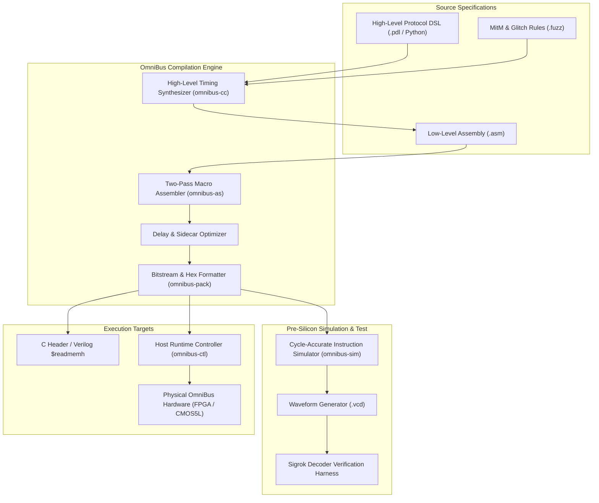
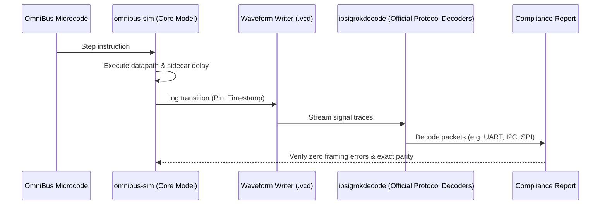

# OmniBus Software Toolchain: Assembler, Compiler, and Simulation Specification

> **Toolchain Specification for the OmniBus Protocol Emulator ASIC**  
> **Target Architecture**: OmniBus 16-bit Deterministic Protocol Engine  
> **Toolchain Components**: Assembler (`omnibus-as`), High-Level Protocol DSL (`omnibus-cc`), Cycle-Accurate Simulator (`omnibus-sim`), and Host Loader (`omnibus-ctl`)

---

## 1. Overview and Design Principles

The OmniBus ASIC requires a software toolchain that guarantees sub-cycle timing predictability while remaining accessible to hardware engineers, firmware developers, and security researchers.

The toolchain addresses three central challenges:
1. **Timing-Preserving Assembly**: The assembler must calculate and pack hardware sidecar delays directly into 16-bit opcodes without relying on software runtime loops or arbitrary `NOP` padding.
2. **High-Level Timing Synthesis**: Writing raw assembly for complex protocols (such as USB 1.1 with bit-stuffing, or I2C with clock stretching) is error-prone. A high-level Domain-Specific Language (DSL) must allow declaring timing parameters in physical units (nanoseconds, microseconds, megahertz) and automatically synthesize cycle-exact instruction schedules.
3. **Continuous Verification Before Silicon**: The toolchain integrates directly with software decoders (`libsigrokdecode`) and hardware simulators to validate microcode against industry protocol standards before loading it into FPGA prototypes or fabricated silicon.



---

## 2. Low-Level Assembler Specification (`omnibus-as`)

`omnibus-as` is a two-pass macro assembler tailored specifically to the OmniBus 16-bit instruction format.

### 2.1. Instruction Syntax and Delay Modifiers

Every statement follows this canonical syntax:
```
[label:]   MNEMONIC   operand1 [, operand2]   [[delay]]   [; comment]
```

* **Delay Brackets `[N]`**: Specifies a sidecar delay of `N` cycles ($0 \le N \le 31$) appended to the execution of the instruction.
* **Auto-Delay Expression `[time]`**: Allows physical time expressions (such as `[434 cycles]` or `[8.68 us]`). The assembler automatically converts physical time to cycles based on the declared `.clock` frequency:
  $$\text{Cycles} = \left\lceil \text{Time} \times f_{\text{clk}} \right\rceil$$

### 2.2. Assembly Directives

| Directive | Description | Example |
| :--- | :--- | :--- |
| `.clock <freq>` | Defines master core clock frequency for time calculations | `.clock 50MHz` |
| `.pins` | Declares logical signal aliases to physical crossbar pins | `tx = uio[0], rx = uio[1]` |
| `.entry <label>` | Declares program reset entry point | `.entry main` |
| `.org <addr>` | Sets origin program counter address | `.org 0x00` |
| `.const <id> <val>` | Defines an integer or bitmask constant | `.const BAUDRATE 115200` |
| `.assist <feature>` | Configures autonomous streaming hardware assists | `.assist nrzi=enable, crc=crc16` |

### 2.3. Assembly Code Example: UART Transmitter (8N1 @ 115200 Baud)

```asm
; ==============================================================================
; OmniBus Microcode: UART Transmitter (8N1 @ 115200 Baud, 50 MHz Master Clock)
; Bit duration = 50,000,000 / 115,200 = 434.027 cycles
; Execution = 1 instruction cycle + 433 sidecar delay cycles = 434 cycles/bit
; ==============================================================================

.clock 50MHz

.pins
    tx_pin = uio[0]

.const BIT_DELAY 433

.entry main

main:
    SET tx_pin, 1              ; Initialize TX line to idle high
    
loop:
    PULL ifempty               ; Block until a byte arrives from TX FIFO into OSR
    
    ; Transmit Start Bit (Logic 0)
    SET tx_pin, 0 [BIT_DELAY]  ; Drive low for exactly 434 cycles
    
    ; Transmit 8 Data Bits (LSB First from OSR)
    OUT tx_pin, 8 [BIT_DELAY]  ; Shifts 8 bits, each sustained for 434 cycles
    
    ; Transmit Stop Bit (Logic 1)
    SET tx_pin, 1 [BIT_DELAY]  ; Drive high for 434 cycles
    
    JMP loop                   ; Repeat for next byte
```

### 2.4. Assembly Code Example: I2C Master Byte Read with Clock Stretching

```asm
; ==============================================================================
; OmniBus Microcode: I2C Master Byte Read with Hardware SCL Wait
; ==============================================================================

.clock 50MHz
.pins
    sda = uio[0]  ; Open-drain data
    scl = uio[1]  ; Open-drain clock

.const QUARTER_CYCLE 30  ; ~400 kHz Fast-Mode quarter cycle delay

read_byte:
    MOV LC0, 8           ; Set loop counter to 8 bits

bit_loop:
    SET scl, 0 [QUARTER_CYCLE]
    SET sda, Z [QUARTER_CYCLE] ; Release SDA (open-drain high-Z)
    
    ; Clock high with clock stretching detection:
    SET scl, Z                 ; Release SCL
    WAIT scl, 1 [1000]         ; Wait for slave to release SCL (timeout: 1000 cycles)
    NOP [QUARTER_CYCLE]        ; Setup time
    
    IN sda, 1                  ; Sample 1 bit into ISR
    SET scl, 0 [QUARTER_CYCLE] ; Pull SCL low
    
    DJNZ LC0, bit_loop         ; Loop for all 8 bits
    
    PUSH iffull                ; Deliver complete byte to host RX FIFO
    RET
```

---

## 3. High-Level Protocol DSL and Timing Synthesizer (`omnibus-cc`)

While assembly provides cycle-by-cycle control, implementing multi-state protocols (such as USB enumeration, JTAG TAP navigation, or CAN frame arbitration) is significantly accelerated by a declarative Python-based Domain-Specific Language.

### 3.1. DSL Architecture

The OmniBus Protocol DSL represents protocols as hierarchical state machines with precise timing constraints. The synthesizer:
1. Calculates integer cycle divisions and fractional prescalers.
2. Allocates hardware loop counters (`LC0`, `LC1`) and general registers (`R0`–`R3`).
3. Emits optimized OmniBus assembly code.
4. Reports timing margins and maximum jitter boundaries.

### 3.2. DSL Code Example: SPI Master Transceiver

```python
#!/usr/bin/env python3
"""OmniBus Protocol Definition: Full-Duplex SPI Master (Mode 0)."""

from omnibus_dsl import Protocol, Pin, Direction, ClockEdge

class SPIMaster(Protocol):
    # Pin definitions mapped to Tiny Tapeout bidirectional pins
    sck  = Pin(index=2, direction=Direction.OUTPUT, idle=0)
    mosi = Pin(index=0, direction=Direction.OUTPUT, idle=0)
    miso = Pin(index=1, direction=Direction.INPUT)
    cs_n = Pin(index=3, direction=Direction.OUTPUT, idle=1)

    frequency = 10_000_000  # 10 MHz SPI clock on 50 MHz core (5 cycles per half-period)

    def transfer_byte(self):
        self.cs_n.low()
        self.delay(ns=100)  # CS-to-clock setup time

        with self.loop(count=8):
            # Phase 1: Setup data on falling/idle edge, drive SCK low
            self.mosi.shift_out(source="OSR", count=1)
            self.sck.low(cycles=2)

            # Phase 2: Sample MISO on rising edge, drive SCK high
            self.sck.high(cycles=1)
            self.miso.shift_in(destination="ISR", count=1)
            self.sck.high(cycles=2)

        self.cs_n.high()
        self.delay(ns=100)  # CS hold time
        self.push_rx()

if __name__ == "__main__":
    SPIMaster.compile(output="spi_master.asm", optimize_delay=True)
```

---

## 4. Hardware Security Fuzzing & MitM Rule Compiler (`omnibus-fuzz`)

For hardware security testing, penetration testing, and reverse engineering, `omnibus-fuzz` compiles declarative rule files into hardware match-and-mutate instructions (`MUT`) and glitch schedules (`GLT`).

### 4.1. Fuzzing Rule Syntax Example

```ini
[mitm_target]
interface = spi
bus_pins = mosi:uio[0], miso:uio[1], sck:uio[2], cs_n:uio[3]

[rule_replace_flash_id]
# Match SPI command 0x9F (Read JEDEC ID) and mutate response
trigger = on_rx_byte(0x9F)
replace_response_bytes = [0xEF, 0x40, 0x18] ; Winbond W25Q128 emulation
recalculate_crc = false

[rule_clock_glitch]
# Fire a 20 ns active-high glitch on auxiliary pin uo_out[4] on the 8th clock edge
trigger = on_event_count(sck_rising, count=8)
glitch_pin = uo_out[4]
pulse_width = 1  ; 1 clock cycle (20 ns @ 50 MHz)
```

---

## 5. Cycle-Accurate Simulator and Verification Engine (`omnibus-sim`)

The software simulator allows microcode to be developed, debugged, and formally checked without requiring access to an FPGA or physical silicon.



### 5.1. Simulator Capabilities
* **Bit-Exact Datapath Modeling**: Accurately simulates register states, shift registers, FIFOs, and hardware protocol assists (NRZI, CRC, Manchester, bit-stuffing).
* **Continuous Waveform Streaming**: Generates standard `.vcd` files compatible with GTKWave and PulseView.
* **Sigrok Decoder Bridge**: Directly executes standard protocol decoders against simulated waveforms. If a generated packet suffers from framing errors, timing drift, or incorrect parity, the test runner fails immediately.
* **Timing Jitter Checker**: Validates that pulse widths match timing specifications within zero clock cycles of deviation.

---

## 6. Host Runtime Controller and Driver (`omnibus-ctl`)

`omnibus-ctl` is a cross-platform Python and C communication library that interacts with physical OmniBus hardware (FPGA board or taped-out ASIC) via the host interface (`ui_in[0:3]` / `uo_out[0:3]`).

### 6.1. Host API Capabilities
* **Live Microcode Upload**: Programs the 128-word instruction RAM without resetting external target devices.
* **FIFO Data Streaming**: High-throughput packet streaming through host TX and RX FIFOs.
* **Profiler Query**: Reads hardware histogrammer registers to display detected baud rates, bus states, and inferred protocol types.
* **Interactive Shell / REPL**: Terminal interface for interactive pin control, live packet inspection, and glitch triggering.

### 6.2. Python Host Example

```python
import omnibus

# Connect to physical hardware via USB-UART bridge (Tang Console 60K or Tiny Tapeout board)
device = omnibus.OmniBus(port="COM3", baudrate=115200)

# Query the Hardware Profiler for auto-detected protocols
status = device.profiler.detect()
print(f"Detected Bus: {status.protocol_name} on Pins {status.pins} @ {status.baud} baud")

# Assemble and upload new microcode on-the-fly
program = omnibus.compile("protocols/uart_rx.asm")
device.load_program(program)

# Stream received data
while True:
    packet = device.rx_fifo.read(timeout=1.0)
    if packet:
        print(f"Received Packet: {packet.hex()}")
```

---

## 7. Delivery Roadmap for the Toolchain

1. **Milestone 1: Core Assembler (`omnibus-as` / `python/omnibus_asm.py`) — [DELIVERED & SILICON-PROVEN]**
   - Two-pass assembler, delay packing, instruction encoding, `.hex` and C/Verilog header generation.
   - Comprehensive ISA coverage (Tasks 01 through 24): UART, SPI, I2C, 1-Wire, USB 1.1, CAN 2.0, Ethernet 10BASE-T, Audio APU, IEEE 1149.1 JTAG, ARM SWD, and Quad-SPI/Octal-SPI memory controllers.
   - Validated against 72 automated Cocotb testcases (100% pass rate).
2. **Milestone 2: Simulator & Waveform Engine (`omnibus-sim`)**
   - Cycle-accurate simulator with VCD export and automated Sigrok decoder harness.
3. **Milestone 3: High-Level Protocol Compiler (`omnibus-cc`)**
   - Python declarative DSL for generating UART, SPI, and I2C microcode.
4. **Milestone 4: Host Driver and Profiler Interface (`omnibus-ctl`)**
   - Microcode loader and runtime streaming library tested on Tang Console 60K and Nano 20K.
