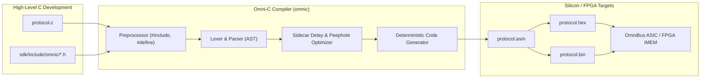

# Omni-C Programming & Compilation Guide

> **Authoritative Developer Guide for High-Level C Programming on the OmniBus ASIC**  
> **Target Processor**: OmniBus 16-bit Deterministic Protocol Engine  
> **Compiler**: Omni-C (`omnic` / `omnibus compile`)  
> **Standard Headers**: `sdk/include/omnic/`  

---

## 1. Introduction

**Omni-C** is an optimizing C-to-Microcode compiler designed specifically for the **OmniBus Protocol Emulator ASIC**. 

While raw OmniBus assembly allows sub-cycle instruction-level control, writing complex multi-state protocols (such as full-duplex UART, open-drain I2C with clock stretching, SPI multi-byte flash streaming, WS2812B NeoPixel drivers, Dallas 1-Wire sensors, wire-speed MitM mutators, and chiptune synthesizers) can be time-consuming in raw assembly. Omni-C bridges this gap by allowing you to write clean, structured C code that compiles directly into cycle-exact 16-bit OmniBus microcode with zero runtime overhead.



### Key Highlights of Omni-C
- **Standard C Syntax**: Familiar functions, variables, expressions, `if`/`else`, `while`, `do-while`, `break`, `continue`, `return`, and `goto`.
- **Zero-Overhead Hardware Loops**: Dedicated `repeat (N)` syntax mapping directly to OmniBus hardware loop counters (`LC0`, `LC1`) and single-cycle `DJNZ` instructions.
- **Hardware-Aware Storage**: Automatic register allocation (`R0`–`R7`, `ACC`) or explicit binding hints (`reg r0 uint8_t x;`).
- **First-Class Hardware Intrinsics**: Direct access to sidecar delays, pin driving (`SET`), edge waiting (`WAIT`), pin crossbar mapping (`PINMAP`), open-drain masking (`CFG_OD`), hardware SERDES (`OUT`, `IN`), FIFO streaming (`PULL`, `PUSH`), CRC engines, and hardware assists.
- **Sidecar Delay Coalescing**: Peephole optimizer that merges execution delays into preceding instructions to preserve silicon code density.
- **Multi-Format Bitstream Output**: Emits `.asm`, Intel/Verilog `.hex`, Verilog `$readmemh` `.mem`, raw binary `.bin`, and embedded C headers `.h`.

---

## 2. Quickstart: Your First Omni-C Protocol

### 2.1. Writing a UART Echo Program in C

Create a file named `uart_echo.c`:

```c
#include <omnibus.h>
#include <uart.h>

#pragma clock 50MHz
#pragma entry main

void main(void) {
    // 1. Initialize UART transceiver on GPIO pin 0 (TX) and pin 1 (RX)
    uart_init();

    // 2. Continuous Full-Duplex Echo Loop
    while (1) {
        // Read incoming byte from host TX FIFO
        pull(BLOCK);

        // Transmit byte over physical UART bus at runtime baud rate
        uart_tx_byte();

        // Push transmitted byte to host RX FIFO for loopback verification
        push(BLOCK);
    }
}
```

### 2.2. Compiling in One Command

Compile the C source into OmniBus assembly and a Verilog hex file using the turnkey `omnic` batch script:

```powershell
# In Windows PowerShell:
.\omnic uart_echo.c -o uart_echo.asm --hex uart_echo.hex

# In Windows Command Prompt (CMD):
omnic uart_echo.c -o uart_echo.asm --hex uart_echo.hex

# Or using the script directory wrapper:
.\scripts\omnic uart_echo.c -o uart_echo.asm --hex uart_echo.hex

# On Linux / macOS / WSL:
./scripts/omnic.sh uart_echo.c -o uart_echo.asm --hex uart_echo.hex

# Or via the Master OmniBus SDK CLI:
python sdk/omnibus/cli.py compile uart_echo.c -o uart_echo.asm --hex uart_echo.hex
```

Output:
```
[*] Compiling Omni-C source 'uart_echo.c'...
[+] Emitted OmniBus Assembly: 'uart_echo.asm' (22 lines)
[*] Assembling microcode via omnibus_asm.py...
[+] Assembled 6 instructions successfully:
  [00 | 0x00]: 0x5008  --  PINMAP tx=0, rx=1, sck=0, cs=0
  [01 | 0x01]: 0x3100  --  SET 0, 1 [0]
  [02 | 0x02]: 0x9001  --  PULL BLOCK
  [03 | 0x03]: 0x1808  --  OUT 8 [$BAUD]
  [04 | 0x04]: 0xA001  --  PUSH BLOCK
  [05 | 0x05]: 0x8002  --  JMP lbl_while_start_1
[+] Wrote Intel/Verilog hex format: 'uart_echo.hex'
[+] Omni-C compilation complete.
```

### 2.3. Loading into Hardware

Upload the compiled program directly into your FPGA prototype or silicon board:

```bash
# Upload to board over serial bootloader:
omnibus load uart_echo.asm --port COM3 --baud 115200
```

---

## 3. Omni-C Language Reference

### 3.1. Data Types & Storage Classes

OmniBus is an 8-bit datapath processor with a 16-bit instruction bus. Omni-C supports the following integer and character types:

| Type | Size | Description | Register Location |
| :--- | :--- | :--- | :--- |
| `uint8_t` / `unsigned char` | 8 bits | Unsigned 8-bit integer ($0 \dots 255$) | `R0`–`R7` or `ACC` |
| `int8_t` / `char` | 8 bits | Signed 8-bit integer ($-128 \dots 127$) | `R0`–`R7` or `ACC` |
| `uint16_t` / `int` | 16 bits | 16-bit integer (used for constants/delays) | Immediate operand |
| `void` | 0 bits | Function return type | None |
| `bool` | 1 bit | Boolean (`0` or `1`) | Zero / Carry Flag |

#### Explicit Register Storage Hint (`reg`)
You can bind a variable directly to a specific physical hardware register using the `reg` keyword:

```c
reg r0 uint8_t rx_count = 0;
reg r1 uint8_t device_addr = 0xA0;
reg acc uint8_t current_byte;
```

If the `reg` keyword is omitted, the compiler's `RegisterAllocator` automatically assigns the variable to an available free register (`R0`–`R7`).

---

### 3.2. Hardware Registers

OmniBus hardware registers are directly accessible in C expressions:

| Register | Read/Write | Description |
| :--- | :--- | :--- |
| `acc` | R/W | 8-bit Main Accumulator. Used for arithmetic, logic, and function return values. |
| `r0` – `r7` | R/W | General-purpose 8-bit registers. |
| `osr` | Write-Only | Output Shift Register (8-bit serialization buffer). |
| `isr` | Read-Only | Input Shift Register (8-bit deserialization buffer). |
| `lc0` | R/W | Hardware Loop Counter 0 (used by outer loops). |
| `lc1` | R/W | Hardware Loop Counter 1 (used by inner nested loops). |
| `flags` | Read-Only | Status flags (`Z` = zero, `C` = carry, `FIFO_EMPTY`, `FIFO_FULL`). |

Example:
```c
void load_and_shift(void) {
    acc = 0x55;
    osr = acc;          // Load accumulator into Output Shift Register
    out_bus(SCK, 8, 2); // Shift 8 bits over bus
}
```

---

### 3.3. Operators & Expressions

Omni-C supports standard C operators which are translated into single-cycle Micro-ALU instructions:

| Category | Operators | Generated Assembly / ALU Operation |
| :--- | :--- | :--- |
| **Arithmetic** | `+`, `-`, `++`, `--` | `ADD acc, src`, `SUB acc, src`, `INC acc`, `DEC acc` |
| **Bitwise** | `&`, `|`, `^`, `~` | `AND acc, src`, `OR acc, src`, `XOR acc, src`, `NOT acc` |
| **Shifts** | `<<`, `>>` | `SHL acc`, `SHR acc`, `ROL acc`, `ROR acc` |
| **Relational** | `==`, `!=`, `<`, `<=`, `>`, `>=` | `CMP acc, src` followed by conditional branch (`JZ`, `JNZ`, `JC`, `JNC`) |
| **Logical** | `&&`, `||`, `!` | Short-circuit boolean jumps |
| **Assignment** | `=`, `+=`, `-=`, `&=`, `|=`, `^=` | Direct register updates |

---

### 3.4. Control Flow Structures

#### 1. Conditional Branches (`if` / `else`)
```c
if (acc == 0x9F) {
    // Flash JEDEC ID command detected
    mitm_replace(0xEF);
} else {
    // Default pass-through
    push(BLOCK);
}
```

#### 2. While Loops (`while`)
```c
while (r0 < 10) {
    nop(10);
    r0++;
}
```

#### 3. Do-While Loops (`do { ... } while`)
```c
do {
    pull(BLOCK);
    out_bus(SCK, 8, 2);
} while (r1 != 0);
```

#### 4. For Loops (`for`) & Automatic Hardware `repeat` Optimization
Standard C `for` loops are automatically analyzed by the compiler. If the loop is a count-based loop whose induction variable is not modified in the body, the compiler **automatically optimizes it into a zero-overhead hardware `repeat(N)` loop** utilizing silicon counters `LC0` and `LC1` with single-cycle `DJNZ` instructions:

```c
// Standard C for-loop:
for (uint8_t i = 0; i < 8; i++) {
    pull(BLOCK);
    out_bus(SCK, 8, 2);
}
```
Compiles directly into:
```asm
SET_LC LC0, 8
lbl_loop_lc0_1:
PULL BLOCK
OUT SCK, 8 [2]
DJNZ LC0, lbl_loop_lc0_1
```

Supported `for` loop patterns for hardware loop synthesis:
- `for (uint8_t i = 0; i < N; i++)` / `++i`
- `for (int i = 0; i <= N-1; i++)`
- `for (int i = 1; i <= N; i++)`
- `for (int i = N; i > 0; i--)` / `--i`
- `for (i = N; i >= 1; i--)`

If the induction variable `i` is accessed for calculations inside the body (e.g., `buffer[i]`), the compiler seamlessly falls back to general `while` loop desugaring with standard register arithmetic.

#### 5. Native Hardware Loop Directives (`repeat`)
You can also use the explicit `repeat (N)` keyword:

```c
// Send 16 consecutive SPI bytes with zero branching overhead
repeat (16) {
    pull(BLOCK);
    out_bus(SCK, 8, 2);
    push(BLOCK);
}
```

#### Nested Hardware Loops
Both nested `for` and `repeat` loops are automatically assigned to separate hardware registers (`LC0` for the outer loop, `LC1` for the inner loop):

```c
for (int row = 0; row < 5; row++) {      // Allocates LC0
    for (int col = 0; col < 8; col++) {  // Allocates LC1
        wait_pin(0, 0, 100);
        wait_pin(0, 1, 100);
        in_bus(1, 1, 0);
    }
    push(BLOCK);
}
```

#### 6. Unconditional Jumps & Labels (`goto`, `break`, `continue`)
```c
loop_start:
    wait_pin(0, 0, 1000);
    if (r0 == 0) {
        goto loop_start;
    }
```

---

### 3.5. Functions & Subroutine Call Stack

Functions are declared using standard C syntax:

```c
uint8_t calculate_checksum(uint8_t a, uint8_t b) {
    acc = a + b;
    return acc;
}

void main(void) {
    reg r0 uint8_t result;
    result = calculate_checksum(10, 20);
}
```

> [!IMPORTANT]
> **Hardware Call Stack Depth**:  
> The OmniBus ASIC contains a **4-deep hardware LIFO call stack**. Function calls compile to `CALL target` and `RET` instructions. Subroutine nesting must not exceed 4 levels.

---

### 3.6. Inline Assembly (`__asm__`)

When you need cycle-exact sidecar delays or specific instruction sequences that cannot be expressed in C, use `__asm__`:

```c
void custom_pulse(void) {
    __asm__("SET tx, 0 [433]");
    __asm__("OUT tx, 8 [433]");
    __asm__("SET tx, 1 [433]");
}
```

---

### 3.7. Preprocessor & Directives

Omni-C includes a built-in preprocessor supporting standard C directives:

- **`#include <filename.h>` / `#include "filename.h"`**: Includes standard protocol headers from `sdk/include/omnic/` or local project files.
- **`#define NAME VALUE`**: Constant definitions.
- **`#define MACRO(x) ...`**: Function-like macros.
- **`#pragma clock <freq>`**: Defines core clock frequency (e.g., `#pragma clock 50MHz`) for delay calculations.
- **`#pragma entry <func>`**: Sets reset vector entry point (defaults to `main`).
- **Hardware Baud Rate Sentinels**:
  - `$BAUD`: Dynamically evaluates to the runtime baud rate divisor configured via `i_baud_div[15:0]`.
  - `$HBAUD`: Dynamically evaluates to the half-bit baud rate divisor (`i_baud_div / 2`).

---

## 4. Hardware Built-in Intrinsics Reference

Omni-C exposes all OmniBus hardware accelerators, SERDES channels, and physical pin drivers through intrinsic built-in functions:

| Function | Emitted Instruction | Description |
| :--- | :--- | :--- |
| `set_pin(pin, val, delay)` | `SET pin, val [delay]` | Drives GPIO pin (0 or 1) or releases in open-drain mode. `delay` is optional (0–31 cycles). |
| `wait_pin(pin, val, delay)` | `WAIT pin, val [delay]` | Blocks until selected GPIO pin equals target logic level. |
| `pinmap(tx, rx, sck, cs)` | `PINMAP tx, rx, sck, cs` | Dynamically remaps protocol roles across physical GPIOs 0..7. |
| `cfg_od(mask)` | `CFG_OD mask` | Programs 8-bit open-drain drive mask across GPIOs 0..7. |
| `out_bus(mode, count, delay)` | `OUT [mode,] count [delay]` | Shifts `count` bits from `OSR` to bus (`SCK`, `1W`, `SDA`, `AUDIO`, `SLAVE`, `QSPI`). |
| `in_bus(mode, count, delay)` | `IN [mode,] count [delay]` | Samples `count` bits from physical bus into `ISR`. |
| `pull(block)` | `PULL [BLOCK]` | Reads next byte from host TX FIFO into `OSR`. Pass `BLOCK` (`1`) to stall if empty. |
| `push(block)` | `PUSH [BLOCK]` | Delivers byte from `ISR` to host RX FIFO. Pass `BLOCK` (`1`) to stall if full. |
| `nop(delay)` | `NOP [delay]` | Cycle-accurate execution delay without modifying state. |
| `crc_init()` | `CRC_INIT` | Resets CRC generator engine to initial polynomial state. |
| `crc_byte()` | `CRC_BYTE` | Feeds accumulator byte through hardware CRC-8/16/32 engine. |
| `crc_read(bank)` | `CRC_READ_B0..B3` | Reads CRC output byte bank (`0`..`3`) into accumulator. |
| `glitch_arm()` | `GLITCH_ARM` | Arms sub-cycle hardware crowbar fault pulse generator. |
| `glitch_cfg(cycles)` | `GLITCH_CFG cycles` | Sets glitch trigger countdown delay (0..65535 cycles). |
| `mitm_enable()` | `MITM_ENABLE` | Activates wire-speed in-flight packet mutation engine. |
| `mitm_match(val)` | `MITM_MATCH val` | Configures pattern match trigger byte. |
| `mitm_replace(val)` | `MITM_REPLACE val` | Configures real-time replacement byte. |
| `audio_vol(vol)` | `AUDIO_VOL vol` | Sets 1-bit Delta-Sigma Audio DAC volume level (0..15). |
| `audio_play(hi, lo)` | `AUDIO_PLAY hi, lo` | Starts autonomous chiptune square-wave note frequency. |
| `audio_stop()` | `AUDIO_STOP` | Mutes audio synthesizer output. |
| `pulse_cfg(pin)` | `PULSE_CFG pin` | Selects target pin for asymmetric pulse engine. |
| `pulse_time0(t_hi, t_lo)` | `PULSE_TIME0 hi, lo` | Configures bit-0 high and low cycle durations (WS2812 / Joybus). |
| `pulse_time1(t_hi, t_lo)` | `PULSE_TIME1 hi, lo` | Configures bit-1 high and low cycle durations (WS2812 / Joybus). |

---

## 5. Standard Protocol Library Reference (`sdk/include/omnic/`)

Omni-C includes standard C headers located in [`sdk/include/omnic/`](file:///c:/Workspace/ASIC/ProtocolEmulator/sdk/include/omnic/):

### 5.1. `omnibus.h` (Core Hardware Definitions)
Includes standard constants, register aliases, logic levels, and pin assignments:
```c
#include <omnibus.h>

// Predefined constants:
// LOW = 0, HIGH = 1, BLOCK = 1, NOBLOCK = 0
// PIN_TX = 0, PIN_RX = 1, PIN_SCK = 2, PIN_CS = 3
```

### 5.2. `uart.h` (UART 8N1 Driver)
Full-duplex UART initialization and transmission:
```c
#include <uart.h>

void main(void) {
    uart_init();          // Maps TX=0, RX=1 and sets idle high
    uart_tx_byte();       // Transmits byte in OSR with start/stop framing
    uart_rx_byte();       // Deserializes byte from RX line into ISR
}
```

### 5.3. `i2c.h` (Open-Drain I2C Master with Clock Stretching)
```c
#include <i2c.h>

void main(void) {
    i2c_init();           // Enables open-drain drive mask on SDA (0) and SCL (1)
    i2c_start();          // Generates I2C START condition
    acc = 0xA0; osr = acc;
    i2c_write_byte();     // Shifts 8 bits with auto-SCK and SCL clock stretching
    i2c_read_byte_ack();  // Reads 8 bits and acknowledges slave
    i2c_stop();           // Generates I2C STOP condition
}
```

### 5.4. `spi.h` (SPI Master Mode 0)
```c
#include <spi.h>

void main(void) {
    spi_init();           // Maps MOSI=0, MISO=1, SCK=2, CS=3
    spi_select();         // Asserts CS low
    acc = 0x9F; osr = acc;
    spi_transfer_byte();  // Full-duplex 8-bit transfer with auto-SCK
    spi_deselect();       // Releases CS high
}
```

### 5.5. `ws2812.h` (WS2812B NeoPixel RGB Driver)
```c
#include <ws2812.h>

void main(void) {
    ws2812_init();        // Sets up 800 kHz asymmetric pulse timing (350ns / 700ns)
    ws2812_reset();       // 50 µs latch reset pulse
    // Stream 24-bit GRB colors from TX FIFO:
    pull(BLOCK); ws2812_send_byte(); // Green
    pull(BLOCK); ws2812_send_byte(); // Red
    pull(BLOCK); ws2812_send_byte(); // Blue
}
```

### 5.6. `onewire.h` (Dallas 1-Wire Master)
```c
#include <onewire.h>

void main(void) {
    onewire_init();       // Enables open-drain mode on GPIO 0
    onewire_reset();      // Generates 480 µs reset pulse and samples presence
    onewire_write_byte(); // Writes 8 bits (LSB first)
    onewire_read_byte();  // Reads 8 bits from slave
}
```

### 5.7. `audio.h` (1-Bit Delta-Sigma DAC & Chiptune Synthesizer)
```c
#include <audio.h>

void main(void) {
    audio_vol(0x0C);      // Set volume (75%)
    NOTE_C4();            // Play Middle C (261.6 Hz)
    nop(5000);            // Sustain note
    NOTE_E4();            // Play E4 (329.6 Hz)
    nop(5000);
    audio_stop();         // Stop playback
}
```

### 5.8. `mitm.h` (Active Wire-Speed MitM Mutator & Glitcher)
```c
#include <mitm.h>

void main(void) {
    glitch_arm_delay(5);  // Arm 20ns glitch pulse after 5 cycles
    mitm_match(0x9F);     // Match SPI Read ID command
    mitm_replace(0xEF);   // Mutate response to Winbond manufacturer ID
    mitm_enable();        // Engage hardware mutation engine
}
```

---

## 6. Compilation & CLI Toolchain

### 6.1. Turnkey Omni-C Compiler Script (`omnic.bat` / `omnic.ps1` / `scripts/omnic.bat`)

The fastest way to compile C protocols is using the project's native script wrappers:

```powershell
# In Windows PowerShell:
.\omnic <source.c> [options]
# or
.\scripts\omnic <source.c> [options]

# In Windows Command Prompt (CMD):
omnic <source.c> [options]

# On Linux / macOS / WSL:
./scripts/omnic.sh <source.c> [options]
```

#### Available CLI Options:
| Option | Argument | Description |
| :--- | :--- | :--- |
| `-o`, `--output` | `<file.asm>` | Destination path for generated assembly code (default: stdout). |
| `-I`, `--include` | `<dir>` | Additional include search directory for `#include` files. |
| `--hex` | `<file.hex>` | Automatically assemble and emit Intel/Verilog `.hex` image. |
| `--bin` | `<file.bin>` | Automatically assemble and emit raw binary bitstream. |
| `--mem` | `<file.mem>` | Automatically assemble and emit Verilog `$readmemh` format. |
| `--header` | `<file.h>` | Automatically assemble and emit C array firmware header. |
| `--no-opt` | None | Disables peephole optimizer and sidecar delay coalescing. |
| `--verify` | None | Performs automated syntax and IMEM size check. |

#### Full Multi-Format Compilation Example:
```bash
omnic examples/omnic/spi_flash.c \
    -o build/spi_flash.asm \
    --hex build/spi_flash.hex \
    --mem build/spi_flash.mem \
    --bin build/spi_flash.bin \
    --header build/spi_flash.h
```

---

### 6.2. Master SDK CLI Integration (`omnibus compile`)

The compiler is integrated directly into the OmniBus SDK CLI:

```bash
# Compile and assemble:
python sdk/omnibus/cli.py compile examples/omnic/i2c_eeprom.c -o build/i2c_eeprom.asm --hex build/i2c_eeprom.hex
```

---

### 6.3. Turnkey Demo Batch Script

To compile and verify all example applications across UART, I2C, SPI, WS2812B, 1-Wire, and MitM:

```cmd
cmd.exe /c scripts\run_omnic_demo.bat
```

---

## 7. Complete Real-World Protocol Examples

### Example 1: I2C 24C02 EEPROM Read/Write (`examples/omnic/i2c_eeprom.c`)

```c
#include <omnibus.h>
#include <i2c.h>

#pragma clock 50MHz
#pragma entry main

void main(void) {
    i2c_init();

    // 1. Write byte 0x55 to EEPROM address 0x05 at device 0xA0
    i2c_start();
    acc = 0xA0; osr = acc; i2c_write_byte(); // Device Address (Write)
    acc = 0x05; osr = acc; i2c_write_byte(); // Memory Address
    pull(BLOCK);            i2c_write_byte(); // Data Byte from Host TX FIFO
    i2c_stop();

    nop(20); // EEPROM internal write cycle delay

    // 2. Read byte back from EEPROM address 0x05
    i2c_start();
    acc = 0xA0; osr = acc; i2c_write_byte(); // Device Address (Write)
    acc = 0x05; osr = acc; i2c_write_byte(); // Memory Address
    i2c_start();
    acc = 0xA1; osr = acc; i2c_write_byte(); // Device Address (Read)
    i2c_read_byte_ack();                     // Read byte with ACK
    push(BLOCK);                             // Push byte to Host RX FIFO
    i2c_stop();
}
```

---

### Example 2: Winbond W25Q SPI Flash Multi-Byte Streamer (`examples/omnic/spi_flash.c`)

```c
#include <omnibus.h>
#include <spi.h>

#pragma clock 50MHz
#pragma entry main

void main(void) {
    spi_init();

    // 1. Read JEDEC ID (Command 0x9F)
    spi_select();
    acc = 0x9F; osr = acc; spi_transfer_byte();
    repeat (3) {
        spi_transfer_byte();
        push(BLOCK); // Push 3-byte Manufacturer/Device ID to host
    }
    spi_deselect();

    nop(10);

    // 2. Fast Read 16-byte Data Burst (Command 0x03, Address 0x000000)
    spi_select();
    acc = 0x03; osr = acc; spi_transfer_byte(); // Fast Read Opcode
    acc = 0x00; osr = acc; spi_transfer_byte(); // Addr[23:16]
    acc = 0x00; osr = acc; spi_transfer_byte(); // Addr[15:8]
    acc = 0x00; osr = acc; spi_transfer_byte(); // Addr[7:0]

    repeat (16) {
        spi_transfer_byte();
        push(BLOCK); // Stream 16 bytes into host RX FIFO
    }
    spi_deselect();
}
```

---

### Example 3: WS2812B NeoPixel RGB LED Strip (`examples/omnic/ws2812_rainbow.c`)

```c
#include <omnibus.h>
#include <ws2812.h>

#pragma clock 50MHz
#pragma entry main

void main(void) {
    ws2812_init();

    while (1) {
        // Latch reset pulse (50 µs)
        ws2812_reset();

        // Stream 8 RGB LEDs (24 bits = 3 bytes per LED: GRB)
        repeat (8) {
            pull(BLOCK); ws2812_send_byte(); // Green byte
            pull(BLOCK); ws2812_send_byte(); // Red byte
            pull(BLOCK); ws2812_send_byte(); // Blue byte
        }
    }
}
```

---

## 8. Best Practices & Optimization Tips

1. **Use `repeat (N)` Instead of Software Loop Counters**:  
   `repeat (N)` generates zero-overhead single-cycle `DJNZ` instructions using dedicated silicon counters (`LC0`, `LC1`), saving both instruction memory words and clock cycles.
2. **Leverage Automatic Sidecar Delay Coalescing**:  
   Write clean sequential C statements with `nop(cycles)` or sidecar delays. The optimizer automatically merges delays into the preceding `SET`, `WAIT`, `OUT`, or `IN` instruction.
3. **Respect the 4-Deep Call Stack**:  
   Keep subroutine hierarchies flat. Do not exceed 4 levels of function calls.
4. **Utilize Register Binding for High-Throughput Inner Loops**:  
   Declare loop-critical variables using `reg r0` through `reg r7` or `reg acc` to prevent redundant memory moves.
5. **Enforce Open-Drain Safety on Shared Busses**:  
   For I2C and 1-Wire protocols, always call `cfg_od(mask)` to ensure pins only actively pull down and release to High-Z for pull-up resistors.

---

## 9. Conclusion

Omni-C brings modern, structured C programming to cycle-exact silicon protocol emulation. By combining intuitive C syntax with native hardware intrinsics, zero-overhead loop synthesis, and a peephole optimizer, you can rapidly develop robust, production-ready protocol engines for the OmniBus ASIC.
