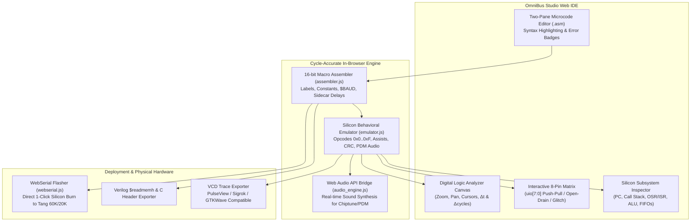

# Task 31: Interactive Web IDE & WebAssembly Visual Emulator (OmniBus Studio)

## 1. Executive Summary & Objectives

Task 31 delivers **OmniBus Studio**—a visual, interactive Web IDE and cycle-accurate silicon micro-engine emulator for the OmniBus Protocol Emulator ASIC. Developed to fulfill the toolchain and developer-experience goals outlined in **`TOOLCHAIN_CONCEPT.md`**, OmniBus Studio enables hardware engineers, firmware developers, and security researchers to write, assemble, debug, simulate, and flash microcode directly from any modern web browser without requiring a local Verilog toolchain or EDA license.



---

## 2. Architecture & File Layout

The Web IDE is completely self-contained under [`web_ide/`](file:///c:/Workspace/ASIC/ProtocolEmulator/web_ide/) with zero external cloud runtime dependencies:

```
web_ide/
├── index.html               # Semantic HTML5 UI layout, controls, and canvas
├── css/
│   └── style.css            # Dark cyberpunk / glassmorphism design system
└── js/
    ├── app.js               # Main application orchestrator & event bus
    ├── assembler.js         # Two-pass 16-bit macro assembler in JavaScript
    ├── emulator.js          # Cycle-accurate behavioral micro-engine emulator
    ├── waveform.js          # Multi-channel logic analyzer & measurement canvas
    ├── audio_engine.js      # Web Audio API bridge for PDM DAC & square-wave audio
    ├── webserial.js         # WebSerial driver for OmniBootloader physical flashing
    └── presets.js           # 12 production-tested protocol & fuzzer presets
```

A one-click launch script is provided at [`scripts/run_web_ide.bat`](file:///c:/Workspace/ASIC/ProtocolEmulator/scripts/run_web_ide.bat).

---

## 3. Core Features & Capabilities

### 3.1. Two-Pass Microcode Assembler (`assembler.js`)
* Fully compatible with [`python/omnibus_asm.py`](file:///c:/Workspace/ASIC/ProtocolEmulator/python/omnibus_asm.py).
* Supports `.clock`, `.const`, `.org`, `.entry`, labels, and automatic time-to-cycle conversion (`[100ns]`, `[8.68us]`, `[$BAUD]`, `[$HBAUD]`).
* Generates 16-bit binary machine code, symbol tables, and Verilog `$readmemh` hex listings in real time.

### 3.2. Cycle-Accurate Silicon Emulator (`emulator.js`)
* Implements all 16 core opcodes (`0x0` through `0xF`):
  - **`NOP`**, **`OUT`**, **`IN`**, **`SET`**, **`WAIT`**, **`PINMAP`**, **`CFG_OD`**, **`DJNZ`**
  - **`JMP`**, **`PULL`**, **`PUSH`**, **`ALU`**, **`CALL`**, **`RET`**, **`CRC`**, **`ASSIST`**
* Emulates open-drain bus safety (`CFG_OD`), 4-deep LIFO hardware call stack, dual 64-byte FIFOs, 32-bit OSR/ISR shift registers, and hardware assists.

### 3.3. Digital Logic Analyzer & Waveform Viewer (`waveform.js`)
* Multi-channel high-DPI canvas tracing:
  - `UIO[0]..UIO[7]` GPIO digital signals
  - `GLITCH_ACTIVE` and `PDM_AUDIO` internal lines
  - `OSR_VALID` and `ISR_VALID` SERDES activity
* Zooming (mouse wheel / slider), panning (drag), and dual measurement cursors ($C_1$, $C_2$) calculating exact $\Delta t$, $\Delta\text{cycles}$, and frequency ($\text{kHz}/\text{MHz}$).

### 3.4. Real-time Audio Synthesizer (`audio_engine.js`)
* Connects the simulated Delta-Sigma PDM DAC output directly to the browser Web Audio API to play live sound waves and chiptune melodies through the user's speakers.

### 3.5. WebSerial Hardware Flasher (`webserial.js`)
* Uses `navigator.serial` to flash assembled microcode directly to physical FPGA development boards (**Tang Console 60K**, **Tang Nano 20K**, **Tang Nano 9K**) via the `OmniBootloader` protocol.

---

## 4. Built-In Protocol Preset Library

| Preset ID | Protocol / Feature | Description |
| :--- | :--- | :--- |
| `uart_tx` | **UART 115200 8N1** | Exact cycle-deterministic 8N1 bit streaming with `$BAUD` delay |
| `i2c_master` | **I2C Master Write & Read** | Open-drain arbitration, START/STOP framing, and SCL clock stretching |
| `neopixel_ws2812` | **WS2812B NeoPixel RGB** | 800 kHz asymmetric high/low pulses for 24-bit GRB LED strips |
| `joybus_n64` | **N64 / GameCube Joybus** | Bidirectional 250 kbps open-collector single-wire controller bus |
| `chiptune_audio` | **Chiptune PDM Audio DAC** | 1-bit Delta-Sigma modulator producing audible multi-tone sound |
| `mitm_glitch` | **Active MitM & Glitch** | Wire-speed opcode matching, payload substitution, and sub-cycle pulse |
| `usb_fs_sof` | **USB 1.1 Full-Speed SOF** | 12 Mbps SOF packet generation with NRZI encoding and CRC-5 |
| `bist_crossbar` | **Autonomous BIST LFSR** | On-chip self-play with PRBS-7 Galois generator and loopback scoring |

---

## 5. Usage & Verification Instructions

### Launching the Web IDE
From Windows command prompt:
```bat
.\scripts\run_web_ide.bat
```
Or open [`web_ide/index.html`](file:///c:/Workspace/ASIC/ProtocolEmulator/web_ide/index.html) in any modern browser (Chrome, Edge, Firefox, Safari).

### Verification
1. Select **"UART 115200 8N1 Transmitter"** from the Preset dropdown.
2. Click **⚡ Assemble** (verifies syntax and displays 0x-hex machine code).
3. Click **▶ Run** (executes simulation and renders live logic analyzer waveform).
4. Use mouse drag to pan and mouse wheel to zoom into individual bits and verify exact 434-cycle bit intervals.
