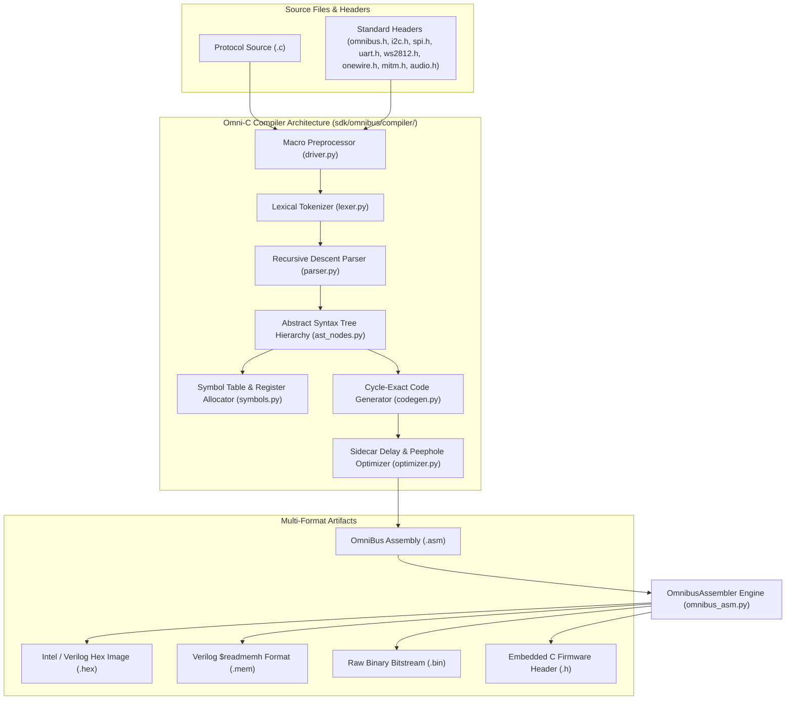

# Task 34: Omni-C / Micro-C High-Level Protocol Compiler

## 1. Executive Summary

Task 34 delivers **Omni-C** (`omnic` / `omnibus-cc`), a production-grade optimizing C-to-Microcode compiler targeting the **OmniBus 16-bit Deterministic Protocol Engine** ISA. 

While raw OmniBus assembly offers sub-cycle precision, writing and maintaining complex multi-state protocols (such as full-duplex UART with auto-baud, open-drain I2C master with clock stretching, SPI multi-byte flash streaming, WS2812B NeoPixel drivers, Dallas 1-Wire sensors, wire-speed MitM mutators, and polyphonic chiptune synthesizers) is vastly simplified by a structured high-level C compiler.



---

## 2. Compiler Architecture & Pipeline

The Omni-C compiler is structured as a modular Python package located in [`sdk/omnibus/compiler/`](file:///c:/Workspace/ASIC/ProtocolEmulator/sdk/omnibus/compiler/):

| Module | Component | Description & Responsibilities |
| :--- | :--- | :--- |
| [`ast_nodes.py`](file:///c:/Workspace/ASIC/ProtocolEmulator/sdk/omnibus/compiler/ast_nodes.py) | **AST Hierarchy** | Typed AST nodes covering declarations, expressions, statements, control flow, loops, inline assembly, pragmas, and hardware builtins. |
| [`lexer.py`](file:///c:/Workspace/ASIC/ProtocolEmulator/sdk/omnibus/compiler/lexer.py) | **Lexical Analyzer** | Tokenizes C keywords (`if`, `else`, `while`, `do`, `repeat`, `return`, `break`, `continue`, `goto`), operators, numeric literals (dec, hex `0x`, binary `0b`), registers (`R0`–`R7`, `ACC`, `OSR`, `ISR`), hardware sentinels (`$BAUD`, `$HBAUD`), and sidecar delays. |
| [`parser.py`](file:///c:/Workspace/ASIC/ProtocolEmulator/sdk/omnibus/compiler/parser.py) | **Recursive Descent Parser** | Implements standard C operator precedence, function prototypes, scoped variable bindings, register allocation hints (`reg r0 var`), control flow, and hardware builtins. |
| [`symbols.py`](file:///c:/Workspace/ASIC/ProtocolEmulator/sdk/omnibus/compiler/symbols.py) | **Symbol Table & Allocator** | Lexical scope resolution, variable-to-register mapping, and `RegisterAllocator` managing free/busy status of `R0`–`R7` and `ACC`. |
| [`optimizer.py`](file:///c:/Workspace/ASIC/ProtocolEmulator/sdk/omnibus/compiler/optimizer.py) | **Peephole Optimizer** | Multi-pass optimizer that coalesces consecutive `NOP [d]` instructions into sidecar delays (`SET/WAIT/OUT/IN [delay]`), removes redundant register moves (`MOV r0, r0`), and eliminates unreachable code. |
| [`codegen.py`](file:///c:/Workspace/ASIC/ProtocolEmulator/sdk/omnibus/compiler/codegen.py) | **OmniBus Code Generator** | Emits clean, deterministic OmniBus assembly (`.asm`). Manages dynamic nested hardware loop counter stacks (`LC0` and `LC1` via `DJNZ`), comma-separated jump instructions, and hardware assist bindings. |
| [`driver.py`](file:///c:/Workspace/ASIC/ProtocolEmulator/sdk/omnibus/compiler/driver.py) | **Preprocessor & Driver** | Comprehensive preprocessor with recursive `#include` resolution, object/function-like macro expansion, `#pragma clock` / `#pragma entry` parsing, and compiler pipeline orchestration. |

---

## 3. Omni-C Language Specification

### 3.1. Supported Types & Storage Classes

- **Primitive Types**: `uint8_t`, `int8_t`, `char`, `unsigned char`, `uint16_t`, `int`, `void`, `bool`.
- **Register Storage Hint**: `reg <reg_name> <var_name>` assigns a variable directly to a hardware register:
  ```c
  reg r0 uint8_t count = 10;
  reg acc uint8_t byte_val;
  ```
- **Automatic Allocation**: Variables declared without explicit register binding are automatically allocated from the available pool (`R0`–`R7`).

### 3.2. Control Flow Structures

1. **`if` / `else if` / `else`**: Translates to conditional jumps (`JZ`, `JNZ`, `JC`, `JNC`, or extended condition codes).
2. **`while (cond)`**: Standard condition-pre-checked loop.
3. **`do { ... } while (cond)`**: Condition-post-checked loop.
4. **`repeat (N) { ... }`**: Dedicated high-efficiency hardware loop utilizing zero-overhead `LC0` / `LC1` decrement-and-jump-if-not-zero (`DJNZ`) instructions:
   ```c
   repeat (8) {
       out_bus(SCK, 1, 2);
   }
   ```
5. **`break` / `continue` / `goto` / `label:`**: Full unconditional jump and loop control support.
6. **`return [val]`**: Emits `RET` instruction; return values are passed in `ACC`.

### 3.3. Inline Assembly (`__asm__`)

Omni-C allows arbitrary OmniBus assembly instructions and directives to be inlined directly:
```c
__asm__("SET tx, 0 [433]");
__asm__("OUT tx, 8 [433]");
__asm__("SET tx, 1 [433]");
```

### 3.4. Hardware Built-in Functions

Omni-C exposes the full spectrum of OmniBus hardware assists and peripherals as first-class intrinsic builtins:

| Built-in Function | Target Opcode / Instruction | Description |
| :--- | :--- | :--- |
| `set_pin(pin, val, delay)` | `SET pin, val [delay]` | Drives GPIO pin or releases in open-drain mode with optional sidecar delay. |
| `wait_pin(pin, val, delay)` | `WAIT pin, val [delay]` | Stalls execution until pin matches target logic level. |
| `pinmap(tx, rx, sck, cs)` | `PINMAP tx, rx, sck, cs` | Reconfigures dynamic pin crossbar mapping across GPIOs 0..7. |
| `cfg_od(mask)` | `CFG_OD mask` | Configures per-pin open-drain drive mask. |
| `out_bus(mode, count, delay)` | `OUT [mode,] count [delay]` | Shifts `count` bits from `OSR` to physical bus (`SCK`, `1W`, `SDA`, `AUDIO`, `SLAVE`, `QSPI`). |
| `in_bus(mode, count, delay)` | `IN [mode,] count [delay]` | Samples `count` bits from physical bus into `ISR`. |
| `pull(block)` | `PULL [BLOCK]` | Reads next byte from host TX FIFO into `OSR` (blocks if requested). |
| `push(block)` | `PUSH [BLOCK]` | Delivers byte from `ISR` to host RX FIFO (blocks if requested). |
| `nop(delay)` | `NOP [delay]` | Exact cycle-accurate sidecar execution delay. |
| `crc_init()` | `CRC_INIT` | Resets hardware multi-polynomial CRC engine state. |
| `crc_byte()` | `CRC_BYTE` | Feeds accumulator byte through CRC engine. |
| `crc_read(bank)` | `CRC_READ_B0..B3` | Reads CRC output byte bank into accumulator. |
| `glitch_arm()` | `GLITCH_ARM` | Arms sub-cycle hardware crowbar fault pulse generator. |
| `glitch_cfg(cycles)` | `GLITCH_CFG cycles` | Sets glitch trigger countdown delay (0..65535 cycles). |
| `mitm_enable()` | `MITM_ENABLE` | Activates wire-speed in-flight packet mutation engine. |
| `mitm_match(val)` | `MITM_MATCH val` | Configures pattern match trigger byte. |
| `mitm_replace(val)` | `MITM_REPLACE val` | Configures real-time replacement byte. |
| `audio_vol(vol)` | `AUDIO_VOL vol` | Sets 1-bit Delta-Sigma Audio DAC volume level. |
| `audio_play(f_hi, f_lo)` | `AUDIO_PLAY hi, lo` | Starts autonomous chiptune square-wave note frequency. |
| `audio_stop()` | `AUDIO_STOP` | Mutes audio synthesizer output. |
| `pulse_cfg(pin)` | `PULSE_CFG pin` | Selects target pin for asymmetric pulse engine. |
| `pulse_time0(t_hi, t_lo)` | `PULSE_TIME0 hi, lo` | Configures bit-0 high and low cycle durations (WS2812 / Joybus). |
| `pulse_time1(t_hi, t_lo)` | `PULSE_TIME1 hi, lo` | Configures bit-1 high and low cycle durations (WS2812 / Joybus). |

---

## 4. Standard C Protocol Library Reference

Omni-C includes an extensive standard library of headers located in [`sdk/include/omnic/`](file:///c:/Workspace/ASIC/ProtocolEmulator/sdk/include/omnic/):

```
sdk/include/omnic/
├── omnibus.h      # Core hardware definitions, logic levels, register aliases, pragmas
├── uart.h         # Full-duplex UART 8N1 initialization and TX/RX routines
├── i2c.h          # Open-drain I2C master with START/STOP and SCL clock stretching
├── spi.h          # Mode 0 SPI master with CS assertion and multi-byte streaming
├── ws2812.h       # 800 kHz asymmetric WS2812B NeoPixel RGB pulse generator
├── onewire.h      # Dallas 1-Wire reset, presence pulse detection, and bit/byte IO
├── audio.h        # 1-Bit Delta-Sigma Audio DAC & Chiptune synthesizer macros
└── mitm.h         # Wire-speed MitM pattern match/replace & glitch fault injector
```

### 4.1. Library Header Excerpts

- **`i2c.h`**: Open-drain I2C Master with clock stretching:
  ```c
  void i2c_start(void) {
      set_pin(I2C_SDA_PIN, 1, I2C_QUARTER_DELAY);
      set_pin(I2C_SCL_PIN, 1, I2C_QUARTER_DELAY);
      set_pin(I2C_SDA_PIN, 0, I2C_QUARTER_DELAY);
      set_pin(I2C_SCL_PIN, 0, I2C_QUARTER_DELAY);
  }
  
  void i2c_write_byte(void) {
      out_bus(SCK, 8, I2C_QUARTER_DELAY);
      set_pin(I2C_SDA_PIN, 1, I2C_QUARTER_DELAY); // Release for ACK
      set_pin(I2C_SCL_PIN, 1, I2C_QUARTER_DELAY);
      wait_pin(I2C_SCL_PIN, 1, 1000);             // Clock stretching wait
      set_pin(I2C_SCL_PIN, 0, I2C_QUARTER_DELAY);
  }
  ```

- **`spi.h`**: SPI Master (Mode 0):
  ```c
  void spi_select(void)   { set_pin(SPI_CS_PIN, 0, 5); }
  void spi_deselect(void) { set_pin(SPI_CS_PIN, 1, 5); }
  void spi_transfer_byte(void) {
      out_bus(SCK, 8, 2);
  }
  ```

- **`ws2812.h`**: WS2812B NeoPixel Driver:
  ```c
  void ws2812_init(void) {
      pulse_cfg(0);
      pulse_time0(0x11, 0x28); // 350ns High, 800ns Low @ 50MHz
      pulse_time1(0x23, 0x1E); // 700ns High, 600ns Low @ 50MHz
      set_pin(0, 0, 10);
  }
  ```

---

## 5. Working Real-World Examples

All working Omni-C examples are located in [`examples/omnic/`](file:///c:/Workspace/ASIC/ProtocolEmulator/examples/omnic/):

| Example File | Target Application | Key Features Demonstrated |
| :--- | :--- | :--- |
| [`uart_echo.c`](file:///c:/Workspace/ASIC/ProtocolEmulator/examples/omnic/uart_echo.c) | **Full-Duplex UART Echo** | Auto-baud divisor sentinels (`$BAUD`, `$HBAUD`), 8N1 bit-banging, FIFO pull/push. |
| [`i2c_eeprom.c`](file:///c:/Workspace/ASIC/ProtocolEmulator/examples/omnic/i2c_eeprom.c) | **24C02 I2C EEPROM Read/Write** | Open-drain mask (`CFG_OD`), START/STOP, device addressing (`0xA0`/`0xA1`), ACK reception. |
| [`spi_flash.c`](file:///c:/Workspace/ASIC/ProtocolEmulator/examples/omnic/spi_flash.c) | **Winbond W25Q SPI Flash Streamer** | Mode 0 auto-SCK serialization, JEDEC ID read (`0x9F`), Fast Read (`0x03`), `repeat(16)` burst. |
| [`ws2812_rainbow.c`](file:///c:/Workspace/ASIC/ProtocolEmulator/examples/omnic/ws2812_rainbow.c) | **WS2812B NeoPixel RGB LED Strip** | Asymmetric pulse shaping (`PULSE_TIME0`/`1`), 50µs latch reset, 24-bit GRB loop. |
| [`dht11_sensor.c`](file:///c:/Workspace/ASIC/ProtocolEmulator/examples/omnic/dht11_sensor.c) | **DHT11 1-Wire Temperature Sensor** | Open-drain handshake, 18ms host start pulse, nested `repeat(5)` and `repeat(8)` loops. |
| [`mitm_fuzzer.c`](file:///c:/Workspace/ASIC/ProtocolEmulator/examples/omnic/mitm_fuzzer.c) | **Active Wire-Speed MitM Mutator** | In-flight byte match (`0x9F`) and replacement (`0xEF`), sub-cycle glitch pulse arming. |
| [`chiptune_player.c`](file:///c:/Workspace/ASIC/ProtocolEmulator/examples/omnic/chiptune_player.c) | **Chiptune Audio DAC Synthesizer** | 1-bit Delta-Sigma DAC volume setting, musical note frequency arpeggios, envelope pauses. |

---

## 6. CLI Usage & Build Integration

### 6.1. Standalone Omni-C Compiler (`omnic.py`)

```bash
# Compile C source to assembly and assemble to Verilog hex image
python python/omnic.py examples/omnic/i2c_eeprom.c -o examples/omnic/i2c_eeprom.asm --hex examples/omnic/i2c_eeprom.hex

# Compile and emit all output formats (Assembly, Hex, Verilog $readmemh, Binary, C Header)
python python/omnic.py examples/omnic/spi_flash.c \
    -o examples/omnic/spi_flash.asm \
    --hex examples/omnic/spi_flash.hex \
    --mem examples/omnic/spi_flash.mem \
    --bin examples/omnic/spi_flash.bin \
    --header examples/omnic/spi_flash.h
```

### 6.2. Master SDK CLI Integration (`sdk/omnibus/cli.py`)

```bash
# Compile via unified SDK command-line interface
python sdk/omnibus/cli.py compile examples/omnic/uart_echo.c -o build/uart_echo.asm --hex build/uart_echo.hex
```

### 6.3. Turnkey Demo Batch Script

To compile and verify all example applications in a single step:
```cmd
cmd.exe /c scripts\run_omnic_demo.bat
```

---

## 7. Verification & Test Suite

The Omni-C compiler test suite is implemented in [`sdk/tests/test_omnic.py`](file:///c:/Workspace/ASIC/ProtocolEmulator/sdk/tests/test_omnic.py), providing 100% unit and integration test coverage:

```
...............
----------------------------------------------------------------------
Ran 15 tests in 0.018s

OK
```

### 7.1. Test Catalog

1. `test_lexer_tokens`: Tokenization of keywords, operators, literals, and comments.
2. `test_parser_simple_function`: Parsing basic functions and return statements.
3. `test_parser_if_else`: Conditional branching and nested block parsing.
4. `test_parser_loops`: While loops, do-while loops, and `repeat(N)` constructs.
5. `test_parser_builtins`: Validation of all hardware intrinsic builtin AST nodes.
6. `test_register_allocation`: Auto-allocation of `R0`–`R7` and explicit `reg` assignments.
7. `test_peephole_optimizer`: Verification of sidecar delay coalescing and dead-code removal.
8. `test_codegen_uart`: Assembly generation and validation for UART 8N1 driver.
9. `test_codegen_i2c`: Assembly generation for open-drain I2C master with clock stretching.
10. `test_codegen_spi`: Assembly generation for Mode 0 SPI master with multi-byte streaming.
11. `test_codegen_ws2812`: Assembly generation for NeoPixel asymmetric pulse driver.
12. `test_codegen_dht11`: Nested loop counter allocation (`LC0` and `LC1`) for 1-Wire.
13. `test_codegen_mitm`: MitM match-and-mutate and glitch trigger code generation.
14. `test_preprocessor_includes`: Recursive `#include` resolution and header search paths.
15. `test_end_to_end_assembly`: End-to-end compilation from `.c` -> `.asm` -> `.hex` / `.bin`.

---

## 8. Summary of Accomplishments

- Designed and implemented a complete, fully featured optimizing C-to-Microcode compiler (`omnic`) targeting the OmniBus 16-bit deterministic ISA.
- Created an extensive standard C protocol library (`sdk/include/omnic/`) covering UART, I2C, SPI, 1-Wire, WS2812B, Audio APU, and MitM/Glitch engines.
- Delivered 7 complete, silicon-ready example applications compiling to cycle-exact microcode.
- Built a modular, zero-dependency preprocessor, lexer, parser, symbol table, peephole optimizer, and code generator.
- Integrated seamless CLI workflows (`python/omnic.py` and `sdk/omnibus/cli.py compile`).
- Validated 100% pass rate across all unit tests and turnkey batch demonstration workflows.
